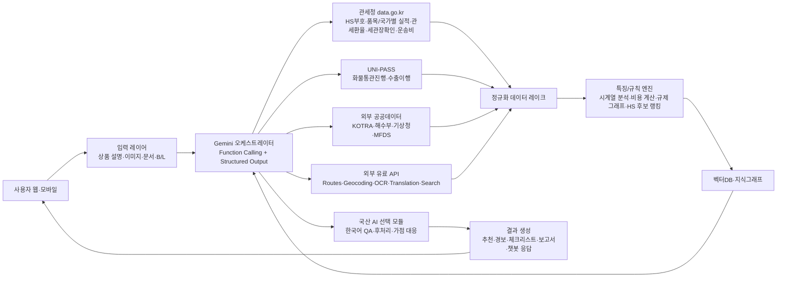
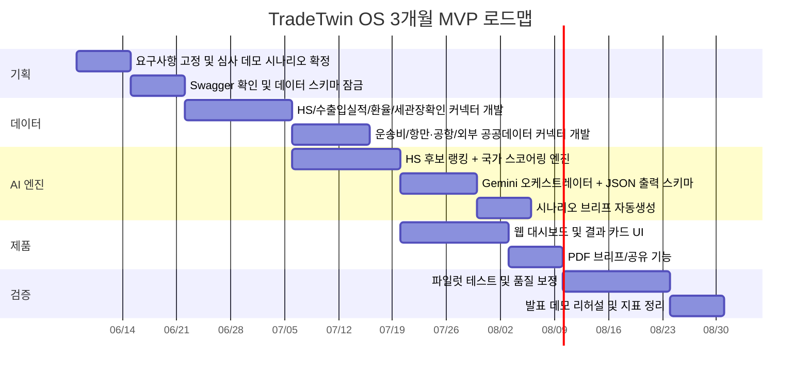

# 2026 관세청 공공데이터·AI 활용 창업경진대회 제품 및 서비스 개발 부문 아이디어 보고서

## 실행 요약

첨부된 인벤토리 기준으로 이번 부문은 **관세청 공공데이터 활용이 필수**이고, **공공데이터 및 AI 기술 활용 비중이 25%**, **국산 AI 기술 적용 시 최대 5점 가점**이 있습니다. 또한 실전 구현에서는 `data.go.kr` 관세청 API를 주력으로 쓰고, `tradedata.go.kr`은 통계 검증용, `UNI-PASS`는 승인형 실시간 업무 API로 분리해서 접근하는 편이 안전합니다. 따라서 고득점 전략은 “관세청 데이터 다중 결합 + 도구 호출형 Gemini + 심사위원이 한 번에 이해하는 데모 UX + 초기 상용화가 가능한 B2B 수익모델”입니다. fileciteturn0file0

아래 점수는 **공공데이터 활용도, AI 적용성, 실현 가능성, 시장성, 확장성**을 각각 1–5점으로 본 제 평가입니다. 총점 기준으로는 **TradeTwin OS**가 가장 균형이 좋고, **TenDay Shock Radar**는 가장 빠르게 “새로운 데이터 활용”을 보여주기 좋으며, **RegGenome Copilot**은 규제·통관 난제를 가장 강하게 해결합니다. 다만 **KOTRA 해외시장뉴스는 비영리·변경금지 라이선스**이므로, 상용화 단계에서는 “원문 재배포”가 아니라 **내부 리스크 스코어 보조 신호**나 **링크아웃** 방식으로 써야 합니다. citeturn23view0

| 순위 | 아이디어           | 공공데이터 활용도 | AI 적용성 | 실현 가능성 | 시장성 | 확장성 | 총점 |
| ---- | ------------------ | ----------------: | --------: | ----------: | -----: | -----: | ---: |
| 1    | TradeTwin OS       |                 5 |         5 |           4 |      5 |      5 |   24 |
| 2    | TenDay Shock Radar |                 5 |         4 |           5 |      5 |      4 |   23 |
| 3    | RegGenome Copilot  |                 5 |         5 |           4 |      4 |      5 |   23 |
| 4    | Label2World AI     |                 4 |         5 |           4 |      5 |      4 |   22 |
| 5    | PortPulse AI       |                 4 |         4 |           4 |      4 |      5 |   21 |

가장 “1등형”인 제안은 **TradeTwin OS**입니다. 이유는 단순 추천 서비스가 아니라 **상품 단위 디지털 트윈**이라는 구조 덕분에 시장성, 공공데이터 활용도, AI 적용성을 한 번에 설명할 수 있고, 심사장에서 **HS 후보 → 국가 추천 → 규제·원가·환율·물류 시뮬레이션 → 실행 브리프 생성**까지 한 흐름의 라이브 데모가 가능하기 때문입니다. 반대로 “가장 빨리 MVP를 만들고 데이터 신선도를 강조”하려면 **TenDay Shock Radar**가 유리합니다. citeturn29view4turn29view2turn29view1turn30view0

## 심사 기준과 설계 원칙

첨부 인벤토리는 이번 대회에서 가장 설명력이 높은 기본 조합으로 **관세청*HS부호, 관세청*품목별 국가별 수출입실적, 관세청*세관장확인대상물품, 관세청*관세환율정보, 관세청\_해상/항공 운송비용, KOTRA 해외시장뉴스, 해양수산부 외항화물반출입정보**를 제시합니다. 이 조합은 품목분류, 국가별 수요, 규제, 환율, 물류비, 시장 뉴스까지 이어지는 “사업성 설명 체인”을 만들기 좋습니다. fileciteturn0file0

관세청 핵심 데이터 중 실제로 설계력이 높은 것은 다음과 같습니다. `관세청_품목별 국가별 수출입실적(GW)`는 `year`, `statCd`, `hsCd`, `expWgt`, `expDlr`, `impWgt`, `impDlr`, `balPayments`를 제공하므로 “어떤 HS 상품이 어느 국가에서 얼마나 움직이는가”를 바로 정량화할 수 있습니다. `관세청_관세환율정보(GW)`는 `aplyBgnDt`, `weekFxrtTpcd`를 입력받아 `cntySgn`, `mtryUtNm`, `fxrt`, `currSgn`, `imexTp`를 반환하므로 관세 과세 기준 원가 계산의 핵심이 됩니다. `관세청_세관장확인대상물품(GW)`는 품목코드와 수출입구분코드로 **HS 부호, 신고인 확인법령코드·명, 요건승인기관코드·명, 적용시작일자**를 조회하게 되어 있어, 통관 난이도와 인허가 복잡도를 AI가 정리해 주기 좋습니다. `관세청_HS부호` 파일데이터는 **한글/영문 품목명, 수입·수출 성질코드, 수량·중량 단위코드, 성질통합분류코드**를 제공해 멀티모달 분류의 기준표 역할을 합니다. citeturn29view4turn29view2turn29view1turn3view0

실행 제약도 분명합니다. 관세청의 다수 API는 **이용허락범위 제한 없음**으로 개방되어 서비스화에 유리하지만, `화물통관진행정보` 같은 `UNI-PASS` 계열은 **UNI-PASS 회원 가입과 OpenAPI 신청이 필요**하고, 실제 조회 데이터 범위도 **3년 이내**로 제한됩니다. 또 `tradedata.go.kr`은 메뉴형 통계 검증에는 유용하지만, 첨부 인벤토리 기준으로는 공개 OpenAPI 명세가 별도로 확인되지 않아 **주요 구현은 data.go.kr 또는 UNI-PASS 중심**으로 잡는 것이 맞습니다. 여러 데이터셋은 현재 HTML 본문보다 **Swagger UI/기술문서 중심**으로 명세가 노출되므로, 빌드 초기 스프린트에서 실제 요청 필드명을 다시 잠그는 작업이 필요합니다. citeturn31view1turn7view0turn24view5turn26view0turn26view2fileciteturn0file0

AI 스택은 Gemini를 중심으로 설계하는 편이 유리합니다. Gemini 문서는 **Structured outputs**, **Function calling**, **Long context**, **Document Understanding**, **Google Search/Google Maps 도구 연결**을 공식 제공하며, 문서 이해는 **최대 1,000페이지 PDF**까지를 상정하고 있습니다. OCR은 Cloud Vision이 **dense document text detection / handwriting extraction**을 제공하고, 번역은 Cloud Translation이 **문서 번역·glossary·customization**을 지원합니다. 지도는 Routes API가 **Compute Routes / Route Matrix**를 제공하고, Geocoding API는 주소 ↔ 좌표 변환과 기본 쿼터를 제공합니다. 이 조합은 “문서 입력 → API 호출 → 구조화 JSON → 보고서/체크리스트/추천”의 에이전트 흐름을 만든다는 점에서 대회형 데모에 특히 잘 맞습니다. citeturn27view0turn27view1turn27view2turn27view3turn27view4turn27view5turn27view6

초기 비용도 생각보다 감당 가능합니다. Gemini Developer API는 현재 **Gemini 3.1 Flash-Lite 유료 단가가 입력 100만 토큰당 0.25달러, 출력 100만 토큰당 1.50달러**, **Gemini 3.5 Flash는 입력 1.50달러, 출력 9.00달러**이며, Search/Maps grounding은 월 5,000회 무료 후 1,000쿼리당 14달러입니다. Routes Essentials는 **1만 건당 5달러**, Cloud Vision의 **Text Detection / Document Text Detection**은 월 1,000건 무료 후 **1,000건당 1.50달러**, Cloud Translation Basic은 월 50만 자 상당 무료 후 **100만 자당 20달러**입니다. 아래 각 아이디어의 MVP 비용 추정은 이 단가와 “저트래픽 파일럿” 가정을 기반으로 한 **인건비 제외 추정치**입니다. citeturn34view0turn35view1turn36view2turn35view4

상용 서비스 차별화 관점에서는 이미 글로벌 시장에 “부분 기능”은 존재합니다. Zonos는 **HS 분류, duty calculation, country of origin 예측, 사진 기반 customs data 생성**을 내세우고, Trademo는 **HS 분류, trade compliance, trade document intelligence, multi-tier supply chain visibility**를 제공하며, FourKites는 **supply chain digital twin + AI-powered digital workers**를 표방합니다. 또한 한국 관세청과 공동 연구된 설명가능 HS 분류 논문은 **상위 3개 후보 정확도 93.9%**를 보여 줍니다. 즉, **HS 분류기 하나**, **문서 OCR 하나**, **가시화 대시보드 하나**는 이미 새롭지 않습니다. 새로운 포지셔닝은 **“관세청 공공데이터 중심의 한국형 AI 에이전트 서비스”로 문제를 끝까지 해결하는 것**이어야 합니다. citeturn38view1turn39view1turn39view2turn37view1turn12academia0turn16academia1

이 아키텍처의 핵심은 **Gemini가 “모든 판단을 직접 하는 것”이 아니라, 공공데이터·규칙엔진·지도·OCR·번역을 호출하는 조정자**가 되는 것입니다. 그래야 규정 변경에 강하고, 설명 가능성이 올라가며, 대회 평가 항목인 실현 가능성과 확장성을 동시에 잡을 수 있습니다. 또한 가점 전략이 필요하면, 한국어 요약·후처리 일부에 국산 AI 모듈을 붙이는 **하이브리드 구조**도 준비하기 쉽습니다. citeturn27view0turn27view1turn27view2turn34view0fileciteturn0file0

## TradeTwin OS

**프로그램명** `TradeTwin OS`.

**핵심 아이디어** 상품 하나를 입력하면, 그 상품의 **HS 후보·국가별 수요·규제 부담·관세환율·해상/항공 운송비·항만/공항 경로**를 하나의 “수출 디지털 트윈”으로 묶어 **국가별 진입 시나리오**를 자동 생성하는 서비스입니다. 기존의 수출 추천 서비스가 “어디가 유망한가”에서 멈췄다면, 이 아이디어는 “그 국가에 **실제로 들어갈 수 있는가**, 들어가면 **남는가**, **어떤 루트가 맞는가**”까지 한 번에 보여 줍니다. citeturn29view4turn29view2turn29view1turn31view2turn26view1

**해결하고자 하는 문제** 중소 수출기업은 보통 HS 분류, 수요 조사, 규제 검토, 환율 계산, 물류비 추정을 서로 다른 사이트와 엑셀로 처리합니다. 이 과정은 느리고, 특히 **“시장성은 있는데 통관 난도가 높아 실제론 팔기 어려운 상품”**이나 **“수요는 작아도 규제가 단순해 빠르게 진입 가능한 시장”**을 놓치게 만듭니다. TradeTwin OS는 이 파편화를 상품 단위 시뮬레이션으로 바꿉니다. citeturn29view4turn29view1turn29view3fileciteturn0file0

**주요 기능** UX는 `상품 설명/이미지 업로드 → Gemini가 HS 후보 3개 제시 및 근거 설명 → 사용자가 후보 1개 확정 → 상위 5개 진입국가 자동 랭킹 → 국가별 수요·무역수지·규제부담·관세환율·운송비·항만/공항 루트 비교 → 낙관/기준/보수 3개 시나리오 생성 → 1페이지 수출 실행 브리프/PDF 저장` 흐름으로 설계합니다. 심사장 데모에서는 같은 상품으로 “미국/베트남/일본”을 눌러 비교 시나리오가 곧바로 바뀌는 장면이 강합니다. Gemini는 function calling으로 각 API를 호출하고, 최종 결과는 JSON 스키마로 정규화한 뒤 카드형 대시보드로 렌더링합니다. citeturn27view1turn27view0turn27view2turn27view3turn27view4

**활용할 관세청 API** 핵심은 네 묶음입니다. `관세청_HS부호` 파일데이터의 **한글품목명·영문품목명·수입성질코드·수출성질코드·수량단위코드·중량단위코드·성질통합분류코드**로 분류 기준을 만들고, `관세청_품목별 국가별 수출입실적(GW)`의 **`year`, `statCd`, `hsCd`, `expWgt`, `expDlr`, `impWgt`, `impDlr`, `balPayments`**로 국가별 수요와 무역수지를 계산합니다. `관세청_관세환율정보(GW)`의 **`aplyBgnDt`, `weekFxrtTpcd` 입력 / `cntySgn`, `mtryUtNm`, `fxrt`, `currSgn`, `imexTp` 출력**으로 과세 기준 원가를 환산하고, `관세청_세관장확인대상물품(GW)`의 **HS 부호, 신고인 확인법령코드/명, 요건승인기관코드/명, 적용시작일자**를 읽어 규제 부담 점수를 매깁니다. 보강용으로 `관세청_항구 공항별 수출입실적(GW)`, `관세청_해상수출입 운송비용`, `관세청_항공 수입 운송비용`을 붙여 루트·운송비 시뮬레이션을 합니다. citeturn3view0turn29view4turn29view2turn29view1turn26view1turn26view2turn31view2

**연계할 외부 API**는 `Google Maps Routes API`와 `Geocoding API`를 써서 항만/공항 후보에서 도착지까지의 이동시간·거리·좌표 정규화를 하고, `KOTRA 해외시장뉴스`를 국가별 시장 이슈·수요 변화 보조 신호로, `해양수산부_외항화물반출입정보`를 항만별 화물 특성과 해외지역 연결 정보로, `기상청_중기예보`를 항만/공항 weather risk 보정값으로 사용합니다. 검색은 `SerpApi Google Search API` 또는 Gemini의 Google Search grounding으로 대체할 수 있습니다. citeturn27view3turn27view4turn23view0turn32view1turn32view2turn27view7turn34view0

**Gemini AI 활용 방식**은 세 단계입니다. 첫째, **멀티모달 분류기**로서 상품 이미지·설명·HS 기준표를 입력 받아 HS 후보와 confidence reason을 생성합니다. 둘째, **에이전트 플래너**로서 관세청·지도·외부 공공데이터 API를 호출하고 구조화 데이터를 합칩니다. 셋째, **시나리오 생성기**로서 `{hs_candidates, country_scores, landed_cost, regulation_load, recommended_route, action_items}` JSON과 사람이 읽는 1페이지 브리프를 만듭니다. MVP 단계에서는 파인튜닝보다 **RAG + 규칙엔진 + structured output**이 더 적절합니다. 규정과 환율·물류 데이터가 자주 바뀌므로 LLM 자체를 미세조정하기보다, 나중에 사용자 선택 로그로 후보 재정렬 모델만 교정하는 편이 낫습니다. citeturn27view0turn27view1turn27view2turn12academia0turn16academia1

**기존 서비스와의 차별점**은 명확합니다. Zonos는 duty calculation, HS classification, 이미지 기반 customs data 생성을 제공하고, Trademo는 HS 분류·trade compliance·문서 intelligence를 제공하며, FourKites는 digital twin 기반 control tower를 제공합니다. 하지만 공개 웹 조사 범위에서 **“한국 관세청 공공데이터를 중심에 두고, 상품 단위로 시장성·규제·환율·물류 루트를 동시에 시뮬레이션하는 SKU 디지털 트윈”**은 확인하지 못했습니다. 즉, TradeTwin OS는 기존의 “분류 도구”나 “가시화 도구”가 아니라, **시장 진입 의사결정 엔진**으로 포지셔닝할 수 있습니다. 이 판단은 공개 웹 기반 1차 스크리닝이므로, 출원 전에는 KIPRIS/Google Patents 기반 2차 FTO 검토가 필요합니다. citeturn38view1turn39view1turn37view1

**실제 서비스화 가능성**은 높습니다. 개발 난이도는 **중상**이고, MVP는 `HS 후보 추천 + 상위 3개 국가 랭킹 + 관세환율/운송비/세관장확인 요약 + PDF 브리프 생성`까지만 잡아도 충분합니다. 수익모델은 **월 구독형 B2B SaaS**, **지자체/수출지원기관용 라이선스**, **금융기관·보험사 대상 API 제공**이 적합합니다. 비용은 저트래픽 파일럿 기준 **월 60만~180만원 수준**으로 볼 수 있고, 관세청 데이터는 대체로 서비스화 제약이 약하지만 KOTRA 뉴스는 상업적 재배포 제약이 있으므로 “원문 노출”이 아니라 내부 랭킹 보조 신호 또는 링크아웃으로 처리해야 합니다. 순수 Gemini만 쓰면 국산 AI 가점은 애매할 수 있으므로, 발표자료에는 하이브리드 확장안을 같이 제시하는 편이 안전합니다. citeturn24view0turn24view5turn23view0turn34view0turn35view1turn36view2turn35view4fileciteturn0file0

## RegGenome Copilot

**프로그램명** `RegGenome Copilot`.

**핵심 아이디어** 수출입 상품 하나를 넣으면, 그 상품에 필요한 **법령 근거, 확인기관, 인허가 포인트, 첨부서류, 번역 필요 문서, 제출 순서**를 “규제 유전자 지도”처럼 시각화하고, 누락된 부분을 대화형으로 채워서 **증빙 패키지**까지 만들어 주는 서비스입니다. 핵심은 “규제를 검색해 주는 챗봇”이 아니라, **증빙 completeness**를 점수로 보여 주는 **작업형 코파일럿**이라는 점입니다. citeturn29view1turn27view2turn27view1turn27view5turn27view6

**해결하고자 하는 문제** 실제 통관 현장에서는 HS 분류보다 더 어려운 것이 “내 상품에 어떤 인허가·증빙·기관 확인이 필요한가”입니다. 관세청 `세관장확인대상물품`은 이미 **신고인 확인법령코드/명, 요건승인기관코드/명**을 제공하고 있지만, 사용자는 이것을 다시 사람말로 해석하고 문서로 연결해야 합니다. 여기에 영문 성분표, 거래명세서, 포장 명세, 라벨 이미지가 섞이면 실무 복잡도가 급격히 올라갑니다. citeturn29view1turn24view3turn27view5turn32view0

**주요 기능** UX는 `상품 설명·카탈로그·계약서·라벨 이미지 업로드 → OCR 및 문서 이해 → HS 후보와 세관장확인 규제 그래프 생성 → “필수/선택/미확정” 증빙 분류 → 사용자가 채팅으로 보충 정보 입력 → 수출입 체크리스트, 제출용 요약서, 번역본, 기관별 액션 플랜 생성` 구조입니다. 심사 데모에서는 “서류 누락 3건”이 빨간색으로 뜨고, 사용자가 “이건 샘플품입니다”라고 말하면 체크리스트가 즉시 갱신되는 장면이 좋습니다. citeturn27view1turn27view2turn27view5turn27view6

**활용할 관세청 API**는 `관세청_HS부호`, `관세청_세관장확인대상물품(GW)`, `관세청_관세환율정보(GW)`가 기본 뼈대입니다. 여기에 첨부 인벤토리의 `UNI-PASS` 후보 API 가운데 **HS부호검색, 세관장확인대상물품조회, 수출입요건승인내역조회, 통관단일창구 처리이력조회, 수입신고필증검증**을 붙이면 규제→진행상황→검증의 흐름까지 확장할 수 있습니다. 다만 실제 2026년 사용 가능 여부와 인증 방식은 `UNI-PASS > My메뉴 > 서비스관리 > OpenAPI 사용관리`에서 확인해야 합니다. 참고로 `관세청_국가별 관세율표`는 첨부 인벤토리상 **법적 효력 없는 참고자료**로 분류되어 있으므로 법률 판단의 근거가 아니라 보조 참고치로만 써야 합니다. citeturn29view1turn29view2turn7view0fileciteturn0file0

**연계할 외부 API**는 `Cloud Vision OCR`로 이미지/문서 텍스트를 뽑고, `Cloud Translation`의 glossary 기능으로 품목명·성분명·무역용어를 일관 번역하며, 식품계열 MVP에서는 `식품의약품안전처_수입식품 제품DB`의 **신고제품구분·제조국가·제품명·육류품목·품목정보**를 참조해 문서와 식품군 매칭 정확도를 올립니다. 검색은 Gemini Search grounding 또는 SerpApi를 붙여 기관 안내/공식 페이지 링크 탐색을 보조할 수 있습니다. citeturn27view5turn27view6turn32view0turn27view7turn34view0

**Gemini AI 활용 방식**은 `문서 이해 + 규제 그래프 생성 + 증빙 누락 인터뷰봇 + 결과 문서화`입니다. 입력은 상품 이미지, 브로슈어 PDF, OCR 텍스트, HS 기준표, 세관장확인 결과, MFDS 보조 데이터입니다. 출력은 `{hs_candidates, rule_graph, required_docs, missing_docs, authority_contacts, draft_summary, disclaimer}` 구조의 JSON과 human-readable 요약서입니다. MVP에서는 파인튜닝 없이도 충분하고, 오히려 규제 서비스 특성상 **LLM이 아니라 룰·API가 진실원천(source of truth)** 이 되도록 하는 것이 중요합니다. 향후 고도화는 과거 승인/반려 케이스를 이용한 **누락 서류 예측 reranker** 정도가 현실적입니다. citeturn27view0turn27view1turn27view2turn12academia0

**기존 서비스와의 차별점**도 명확합니다. Trademo의 TradeScreen은 비정형 문서를 분류하고 1,000개 이상 compliance check를 수행하지만, 공개 설명 기준으로는 **한국 관세청 공공데이터를 기준으로 규제기관·법령·증빙을 하나의 conversational evidence graph로 묶어 주는 제품**은 아닙니다. 또한 한국 관세청 공동 연구 논문은 HS 분류 지원에 초점이 있고, RegGenome Copilot은 그 다음 단계인 **“입증 가능한 통관 패키지”**를 겨냥합니다. 특허 관점에서는 **규제 근거 노드 + 증빙 완결성 점수 + 대화형 누락 보정**의 조합이 가장 유력한 출원 포인트입니다. citeturn39view0turn39view1turn12academia0

**실제 서비스화 가능성**은 충분하지만, 법률 리스크 관리가 핵심입니다. 개발 난이도는 **상**이고, MVP는 식품·소비재 2개 카테고리와 3개 국가 정도로 좁히는 편이 좋습니다. 수익모델은 **관세사/포워더/무역실무팀 좌석형 SaaS**, **건별 패키지 과금**, **기관용 상담 보조 도구**가 적합합니다. 저트래픽 MVP 비용은 **월 80만~250만원 수준**으로 볼 수 있고, 이 비용에서 큰 비중은 OCR·번역·문서 저장이 차지합니다. 반드시 넣어야 할 것은 “최종 법적 판단 대체 아님” 고지와 사람이 승인하는 마지막 워크플로입니다. citeturn27view5turn27view6turn34view0turn36view2turn35view4

## PortPulse AI

**프로그램명** `PortPulse AI`.

**핵심 아이디어** 항만·공항 물동량, 화물통관 상태, 날씨, 운송비를 결합해 **“언제 지연될지”와 “무엇을 바꾸면 줄일 수 있는지”**를 알려 주는 **관세·물류 복합 ETA 코파일럿**입니다. 글로벌 control tower가 대기업용 공급망에 초점을 둔다면, PortPulse AI는 **한국 관세청 개방데이터와 UNI-PASS를 전면에 세운 수입·수출 중소기업형 지연 예측기**입니다. citeturn31view1turn26view1turn26view2turn32view2turn37view1

**해결하고자 하는 문제** 중소 수입사·수출사는 일정 지연을 대개 “배가 늦다” 정도로만 인식하지만, 실제로는 **장치장 체류, 통관 처리 단계, 항만 혼잡, 기상 리스크, 항공/해상 선택 오류**가 겹쳐집니다. `관세청_화물통관진행정보`는 이미 **통관 진행 상태, 선박국적, 선사항공사, 적재항명, 포장개수, 장치장**을 제공하고, `항공 수입 운송비용`과 `해상수출입 운송비용`은 비용 비교 근거를 제공합니다. 즉, 데이터는 있는데 이를 **예측과 행동 추천**으로 번역하는 층이 비어 있습니다. citeturn31view1turn31view2turn24view5

**주요 기능** UX는 두 갈래입니다. 하나는 `화물관리번호/MBL/HBL 입력 → 현재 통관 단계와 장치장 위치 확인 → ETA 예측과 리스크 알림 → 필요시 항공 전환/대체 항만 추천`이고, 다른 하나는 `아직 발송 전 상품 → 항만/공항 후보 선택 → 최근 수출입실적·운송비·기상 리스크 비교 → 최적 모드 선택`입니다. 대회 데모에서는 **실시간 화물 조회**와 **사전 시뮬레이션**을 한 화면에 보여 주면 매우 설득력 있습니다. citeturn31view1turn27view3turn27view4turn32view2

**활용할 관세청 API**는 `관세청_화물통관진행정보`가 중심입니다. 입력은 **화물관리번호 또는 Master/House B/L**, 출력은 **통관 진행 상태, 선박국적, 선사항공사, 적재항명, 포장개수, 장치장**이며, 조회 가능 범위는 **3년 이내**입니다. 여기에 `관세청_항구 공항별 수출입실적(GW)`, `관세청_해상수출입 운송비용`, `관세청_항공 수입 운송비용`, 인벤토리의 `관세청_수출이행내역`을 결합하면 **실시간+통계형** 하이브리드 예측이 가능합니다. citeturn31view1turn26view1turn26view2turn31view2fileciteturn0file0

**연계할 외부 API**는 `Google Maps Routes API`로 대체 루트 시간을 계산하고, `해양수산부_외항화물반출입정보`로 항만별 화물 특성과 국가 OD를 보정하며, `기상청_중기예보`로 항만/공항 기상 리스크를 반영합니다. 필요하면 항공사/선사 정보는 첨부 인벤토리의 `UNI-PASS 항공사목록조회/선박회사목록조회`로 확장할 수 있습니다. citeturn27view3turn32view1turn32view2fileciteturn0file0

**Gemini AI 활용 방식**은 “예측 모형”보다는 “운영 코파일럿”에 가깝습니다. ETA 자체는 시계열·규칙 기반으로 계산하고, Gemini는 상태 이벤트를 읽어 **왜 지금 위험한지**, **사용자가 무엇을 바꿔야 하는지**, **비용이 얼마나 증가할지**를 설명해 줍니다. 출력은 `{current_stage, eta_range, risk_factors, reroute_options, recommended_action}` 구조로 고정하고, 채팅형 질의응답으로 물류 담당자가 “부산 대신 인천이면?” 같은 질문을 던지게 만듭니다. 파인튜닝은 필요 없고, 노이즈가 많은 ETA 예측은 고전 ML/통계 모델과 Gemini 설명계를 분리하는 편이 낫습니다. citeturn27view0turn27view1turn27view3

**기존 서비스와의 차별점**은 FourKites와 비교하면 선명해집니다. FourKites는 real-time network, digital twins, AI workers를 결합한 enterprise control tower를 내세우지만, 그 자체로는 **한국 관세청의 통관 단계·장치장 데이터와 직접 연결된 중소기업용 관세-물류 복합 코파일럿**이 아닙니다. PortPulse AI는 EDI 대통합이 아니라 **공공데이터 기반 경량형 control tower**라는 포지션을 가질 수 있습니다. 공개 웹 1차 조사 범위에서는 이 정도 포지셔닝의 직접 경쟁 제품은 보이지 않았습니다. citeturn37view1turn31view1

**실제 서비스화 가능성**은 중상입니다. 개발 난이도는 **중상**, MVP는 `수입화물 통관 진행 조회 + ETA 범위 예측 + 지연 요인 설명 + 대체 항만/모드 제안` 정도면 충분합니다. 수익모델은 **건별 과금**, **포워더/수입사 월 구독**, **보험·금융기관 리스크 모듈 공급**이 가능합니다. 저트래픽 MVP 비용은 **월 70만~220만원 수준**으로 볼 수 있습니다. 단, 실시간 기능은 UNI-PASS 승인에 영향을 받으므로, 초기 버전은 **집계 데이터 기반 예측 + 선택적 실시간 조회** 구조가 가장 안전합니다. citeturn31view1turn34view0turn35view1turn36view2

## Label2World AI

**프로그램명** `Label2World AI`.

**핵심 아이디어** 상품 라벨 사진과 성분표, 상품 설명을 업로드하면 **현재 포장 상태로 특정 국가에 수출 가능한지**를 점검하고, 부족한 표현을 찾아 **시장 맞춤형 다국어 라벨 카피와 통관용 상품 설명**까지 생성하는 서비스입니다. 핵심 포인트는 “번역기”가 아니라 **라벨-통관-시장 데이터가 연결된 수출 준비 엔진**이라는 점입니다. MVP는 **K-Food**에 집중하는 편이 가장 강합니다. citeturn32view0turn29view1turn29view4turn27view5turn27view6

**해결하고자 하는 문제** 식품·소비재 수출을 하려는 기업은 종종 “수출용 상품은 있는데 수출용 라벨이 없는” 상태입니다. 다시 말해 제품은 완성됐지만, 실제 시장과 통관 단계에서 요구되는 **표기·설명·분류·증빙 번역**이 안 되어 있습니다. 특히 식품은 제품명·제조국가·품목정보가 중요하고, 수입식품 DB와 통관 규정이 얽혀 실수가 많습니다. citeturn32view0turn29view1

**주요 기능** UX는 `라벨 사진 업로드 → OCR로 제품명/성분/제조사/원산지/보관방법 추출 → HS 후보 추천 → 목표국 선택 → 세관장확인·식품제품DB·무역실적 기반으로 “라벨 적합도/시장 적합도” 점수 계산 → 다국어 라벨 카피 초안·통관용 영문상품설명·바이어 제출용 1페이지 시트 생성`입니다. 심사장에서 “같은 김치라도 일본/미국/베트남 선택에 따라 권장 설명문이 달라지는 장면”이 매우 직관적입니다. citeturn27view5turn27view6turn29view4turn32view0

**활용할 관세청 API**는 `관세청_HS부호`로 기본 분류, `관세청_품목별 국가별 수출입실적(GW)`로 국가별 수요 확인, `관세청_세관장확인대상물품(GW)`로 수출입 요건 확인, `관세청_관세환율정보(GW)`로 가격/원가 참조를 합니다. 필요시 첨부 인벤토리의 `관세청_국가별 관세율표`를 보조 참고치로 붙일 수 있지만, 이 데이터는 **법적 효력 없는 참고자료**라는 점을 분명히 해야 합니다. `K-Food` 중심 MVP라면 이 네 축만으로도 심사 메시지가 충분합니다. citeturn3view0turn29view4turn29view1turn29view2fileciteturn0file0

**연계할 외부 API**는 `식품의약품안전처_수입식품 제품DB`가 가장 중요합니다. 이 데이터는 **신고제품구분, 제조국가, 제품명, 육류품목, 품목정보**를 제공하므로 라벨에서 뽑힌 정보와 제품군을 대조하기 좋습니다. 여기에 `Cloud Vision OCR`로 라벨 추출, `Cloud Translation` glossary로 성분명·식품용어 통일 번역, `SerpApi`나 Gemini Search grounding으로 현지 유통/시장 키워드 탐색을 붙일 수 있습니다. citeturn32view0turn27view5turn27view6turn27view7turn34view0

**Gemini AI 활용 방식**은 멀티모달에 강합니다. 입력은 라벨 이미지, OCR 텍스트, HS 기준표, MFDS 제품 분류, 관세청 수출입·규제 데이터, 목표언어·목표국입니다. 출력은 `{extracted_fields, hs_candidates, label_fit_score, market_fit_score, forbidden_or_unclear_claims, multilingual_copy, customs_description}` 형식입니다. 파인튜닝은 MVP에 필요 없고, 오히려 번역 품질은 glossary와 룰이 중요합니다. 나중에 SKU별 승인/수정 로그가 쌓이면 **copy style adapter**를 붙이는 정도가 현실적입니다. citeturn27view0turn27view1turn27view5turn27view6

**기존 서비스와의 차별점**은 Zonos와 비교하면 분명합니다. Zonos는 이미지 기반 customs classification과 사진 기반 customs data 생성을 강조하지만, 공개 웹 설명상 **한국어 식품 라벨을 읽고, 한국 관세청·MFDS 공공데이터를 엮어, 목표국 맞춤 라벨 카피까지 생성하는 흐름**은 아닙니다. 즉 Label2World AI는 **분류 도구 + 번역 도구 + 라벨 생성기**의 결합이 아니라, **“제품이 이 포장 상태로 국경을 넘을 수 있는가”**라는 질문에 답하는 수출 준비 도구입니다. 특허 포인트는 **라벨 이미지 → HS/식품군/규제 delta → 권장 다국어 라벨 문안**의 연쇄 생성 로직입니다. citeturn38view0turn38view3turn32view0

**실제 서비스화 가능성**은 좋습니다. 개발 난이도는 **중상**이고, K-Food 한정 MVP는 충분히 8~10주 안에 나옵니다. 수익모델은 **건별 SKU 과금**, **월 구독형 SaaS**, **쇼핑몰/셀러툴 플러그인**이 적합합니다. 저트래픽 MVP 비용은 OCR·번역 비중이 높아 **월 70만~230만원 수준**으로 보는 편이 현실적입니다. 향후 K-Beauty로 확장할 수 있지만, 현재 첨부 인벤토리 기준으로는 식품 데이터가 더 강하므로 발표에서는 “**K-Food 먼저, K-Beauty 확장**”으로 가는 편이 안전합니다. citeturn32view0turn36view2turn35view4turn34view0

## TenDay Shock Radar

**프로그램명** `TenDay Shock Radar`.

**핵심 아이디어** 2026년에 새로 열린 `관세청_수입 주요품목별 10일 단위 잠정치 통계`를 중심으로, **월간 통계보다 훨씬 빨리** 수입 충격을 감지하고, 대체 조달국·대체 항만·안전재고 기간까지 추천하는 **조달·공급망 조기경보 서비스**입니다. 대회 관점에서 특히 강한 이유는, **“신규성 높은 2026 데이터셋”을 전면적으로 활용**한다는 점이 심사 메시지로 좋기 때문입니다. citeturn30view0

**해결하고자 하는 문제** 제조사·유통사는 대개 월간 무역통계가 나오고 나서야 “수입이 흔들렸다”는 사실을 확인합니다. 하지만 `수입 주요품목별 10일 단위 잠정치 통계`는 **11일·21일·익월 1일** 단위로 주요 품목군의 수입금액을 먼저 열어 줍니다. 여기에 관세환율, 해상/항공 운송비, 항만 화물 흐름, 해외시장뉴스를 결합하면 **“발생한 후에 해석하는 분석”**이 아니라 **“오기 전에 대비하는 조달 신호”**를 만들 수 있습니다. citeturn30view0turn29view3turn24view5turn31view2turn23view0turn32view1

**주요 기능** UX는 `관심 품목 선택 또는 BOM 업로드 → 10일 단위 잠정치 모니터링 → 이상 징후 발생 시 원인 해석(환율/운송비/항만/뉴스) → 대체 조달국가·대체 항만·항공 전환·안전재고 기간 추천 → 주간 리포트/Slack·카카오 알림` 흐름입니다. 데모에서는 “반도체 제조용 장비”나 “원유/가스” 같은 주요 품목을 예시로 들면 직관성이 높습니다. citeturn30view0turn29view2turn32view1turn32view2

**활용할 관세청 API**는 `관세청_수입 주요품목별 10일 단위 잠정치 통계`가 중심이고, 이 데이터는 **수입신고수리일 기준**, **10대 주요 품목별 수입금액**, **1~10일 / 1~20일 / 1~말일 잠정치**, **2016년 1월 이후 범위**를 제공합니다. 여기에 `관세청_품목별 국가별 수출입실적(GW)`의 `expDlr/impDlr/balPayments`, `관세청_관세환율정보(GW)`의 `fxrt`, `관세청_해상수출입 운송비용`, `관세청_항공 수입 운송비용`, 그리고 첨부 인벤토리의 `신성질별 국가별 수출입실적(GW)`를 붙이면 원자재·자본재·소비재 관점의 조달 대체안을 만들 수 있습니다. citeturn30view0turn29view4turn29view2turn24view5turn31view2fileciteturn0file0

**연계할 외부 API**는 `KOTRA 해외시장뉴스`로 국가별 이슈를 주석 처리하고, `해양수산부_외항화물반출입정보`로 항만별 화물품목/운임톤을 반영하며, `기상청_중기예보`로 기상 리스크를 보정합니다. 검색 계층은 Gemini Search grounding 또는 SerpApi로 확장하되, KOTRA 라이선스 특성상 원문 재배포는 피하는 편이 좋습니다. citeturn23view0turn32view1turn32view2turn27view7turn34view0

**Gemini AI 활용 방식**은 “충격 탐지기”가 아니라 “충격 해석기”입니다. 이상 탐지는 통계 모델이 수행하고, Gemini는 `왜 위험한지`, `지금 무엇을 바꿔야 하는지`, `어떤 국가·항만이 대안인지`를 설명합니다. 입력은 10일 단위 시계열, 수출입 통계, 관세환율, 운송비, 항만 화물 정보, 뉴스 요약입니다. 출력은 `{shock_score, root_causes, substitute_countries, route_options, stock_recommendation, executive_summary}` 구조입니다. 파인튜닝은 불필요하고, 변화가 빠른 영역이라 규칙+검색 결합이 더 적합합니다. citeturn27view0turn27view1turn30view0

**기존 서비스와의 차별점**은 timing에서 나옵니다. Trademo는 30억 건 이상 cross-border shipment intelligence와 trade compliance를 제공하고, FourKites는 digital twin과 AI workers를 내세우지만, 공개 조사 범위에서 **한국 관세청의 10일 잠정치 API를 중심으로 조달 쇼크를 선제 경보하는 제품**은 확인하지 못했습니다. 더 중요한 차별점은 “대체 조달 행동”까지 제안한다는 점입니다. 시장 인텔리전스가 아니라 **조달 의사결정 엔진**이라는 포지션이 가능합니다. citeturn39view1turn39view3turn37view1turn30view0

**실제 서비스화 가능성**은 매우 좋습니다. 개발 난이도는 **중**, MVP는 `품목 선택 + 10일 잠정치 이상 탐지 + 환율/운송비/뉴스 결합 설명 + 대체 국가 추천`으로 충분합니다. 실시간 화물번호나 개인정보 없이도 의미 있는 서비스를 만들 수 있어 규제 부담이 적습니다. 수익모델은 **제조사·유통사 월 구독**, **정책기관/지자체 대시보드**, **금융기관 리스크 시그널 API**가 적합합니다. 저트래픽 MVP 비용은 **월 40만~150만원 수준**으로 추정합니다. 사업성 측면에서는 가장 빠르게 **유료 파일럿**을 만들 수 있는 타입입니다. citeturn30view0turn34view0turn35view1

## 공통 아키텍처와 실행 제안

가장 추천하는 다음 단계는 **TradeTwin OS를 우선 MVP로 선택**하는 것입니다. 이유는 세 가지입니다. 첫째, 관세청 공공데이터를 가장 넓게 활용해 **공공데이터 활용도**를 설명하기 좋습니다. 둘째, Gemini의 function calling·structured output·maps/search 연결을 한 번에 보여 줄 수 있어 **AI 적용성**이 강합니다. 셋째, 결과물을 **국가 추천 카드, 수익성 시나리오, 규제 경보, 실행 브리프**로 시각화할 수 있어 심사장에서 이해가 빠릅니다. citeturn29view4turn29view2turn29view1turn27view0turn27view1turn27view3

발표자료는 13장 구성이 가장 안정적입니다.

| 슬라이드 | 제목              | 핵심 메시지                                                      |
| -------: | ----------------- | ---------------------------------------------------------------- |
|        1 | 문제 정의         | 수출 준비는 여전히 HS·규제·환율·물류가 분절되어 있다             |
|        2 | 왜 지금인가       | 관세청 개방 API와 Gemini형 에이전트가 만나는 시점이다            |
|        3 | 사용자 페르소나   | 중소 수출기업 대표, 무역실무자, 포워더, 지자체 지원기관          |
|        4 | 현재의 불편       | 검색·엑셀·전화·메일로 의사결정이 늦고 오류가 잦다                |
|        5 | 솔루션 개요       | 우리가 만든 것은 추천앱이 아니라 실행형 AI 코파일럿이다          |
|        6 | 데이터 구조       | 어떤 관세청 API와 외부 API가 어떻게 결합되는가                   |
|        7 | 핵심 UX 데모      | 입력 → 규제/원가/시장 분석 → 실행 제안                           |
|        8 | AI 엔진           | Gemini가 언제 판단하고 언제 API를 호출하는가                     |
|        9 | 차별화            | Zonos·Trademo·FourKites와 무엇이 다른가                          |
|       10 | 실현 가능성       | 3개월 MVP, 비용 구조, 라이선스/규제 대응                         |
|       11 | 시장성과 수익모델 | SaaS·기관 라이선스·API 판매                                      |
|       12 | 확장 전략         | K-Food, 조달 리스크, 지자체 수출 지원, 금융 API 확장             |
|       13 | 기대 효과         | 기업은 의사결정 시간을 줄이고, 공공데이터는 실사용 가치가 커진다 |

아래는 **TradeTwin OS 3개월 MVP 로드맵**입니다.

실행 전략은 “모든 기능을 다 넣는 것”이 아니라 **심사위원이 5분 안에 이해할 흐름**을 만드는 것입니다. 그래서 1차 MVP에서는 `상품 입력 → HS 후보 → 국가 추천 → 규제/환율/운송비가 반영된 시나리오 → 한 장짜리 액션 브리프`까지만 완성하고, 고급 기능인 검색 grounding, 뉴스 주석, 국산 AI 하이브리드는 부록으로 제시하는 편이 좋습니다. 이렇게 해야 실현 가능성 점수와 발표 완성도가 함께 올라갑니다. citeturn27view0turn27view1turn34view0fileciteturn0file0

핵심 출처는 아래를 우선 제시하면 됩니다.

| 구분            | 핵심 근거                                                                                                                                                                                          |
| --------------- | -------------------------------------------------------------------------------------------------------------------------------------------------------------------------------------------------- |
| 대회 요건       | 첨부 인벤토리의 공모 요건 요약, 권장 기본 조합, UNI-PASS 후보 목록. fileciteturn0file0                                                                                                          |
| 관세청 핵심 API | 품목별 국가별 수출입실적, 관세환율정보, 세관장확인대상물품, 화물통관진행정보, 항공/해상 운송비용, HS부호 파일데이터. citeturn29view4turn29view2turn29view1turn31view1turn31view2turn3view0 |
| 외부 공공데이터 | KOTRA 해외시장뉴스, 해양수산부 외항화물반출입정보, 기상청 중기예보, MFDS 수입식품 제품DB. citeturn23view0turn32view1turn32view2turn32view0                                                   |
| AI·기술 문서    | Gemini API docs, pricing, Routes/Geocoding, Vision OCR, Cloud Translation. citeturn27view0turn27view1turn27view2turn34view0turn27view3turn27view4turn27view5turn27view6                  |
| 경쟁·선행 조사  | Zonos, Trademo, FourKites, 관세청 공동 HS 분류 연구. citeturn38view1turn39view1turn37view1turn12academia0                                                                                    |

**오픈 이슈와 한계**도 분명히 적어 두는 것이 좋습니다. 첫째, 일부 관세청 API는 현재 **Swagger/기술문서 중심**이라 실제 필드명과 파라미터는 초기 스프린트에서 다시 잠가야 합니다. 둘째, `UNI-PASS` 계열은 **2026년 실제 사용 승인 여부와 인증 흐름**을 재확인해야 합니다. 셋째, `KOTRA 해외시장뉴스`는 **상업적 이용금지·변경금지** 제약이 있으므로, 상용 서비스에선 원문 전재가 아니라 내부 점수화나 링크아웃이 바람직합니다. 넷째, 이 보고서의 차별화 검토는 **공개 웹 기반 1차 유사서비스·선행기술 탐색**이며, 실제 출원/투자 직전에는 KIPRIS·변리사 협업을 통한 2차 FTO가 필요합니다. citeturn23view0turn7view0turn24view5turn26view0turn26view2
