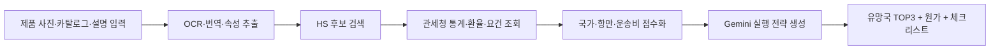
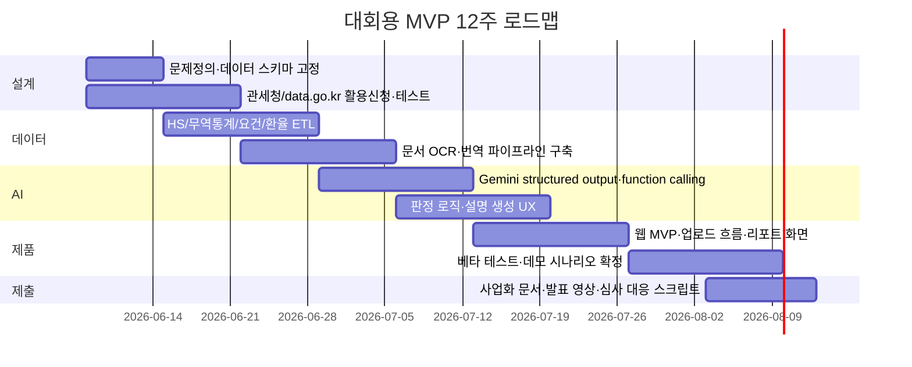

# 2026 관세청 공공데이터·AI 창업경진대회 우승형 프로그램 아이디어 보고서

## Executive Summary

첨부 인벤토리 기준으로 이번 제품·서비스 개발 부문은 **관세청 공공데이터 활용이 필수**이고, 동시에 **AI 기술 활용**이 평가 핵심입니다. 특히 설명력이 높은 기본 조합으로는 `HS부호`, `품목별 국가별 수출입실적`, `세관장확인대상물품`, `관세환율정보`, `운송비용` 계열 데이터가 제시되어 있습니다. 즉, 우승 가능성이 높은 아이템은 “AI를 얹은 일반 SaaS”가 아니라, **관세청 데이터가 아니면 성립하지 않는 서비스**여야 합니다. fileciteturn0file0

이 기준으로 보면 가장 강한 방향은 **대시보드형 조회 서비스**가 아니라, **멀티모달 입력을 받아 관세청 데이터와 외부 공공/민간 API를 조합해 실행 가능한 판단을 내리는 에이전트형 서비스**입니다. 본 보고서는 그 관점에서 5개 아이디어를 추렸고, **1순위는 보더렌즈**, **2순위는 트윈게이트**, **3순위는 펄스스위치**를 추천합니다. 보더렌즈는 사진·라벨·카탈로그만 넣으면 통관 가능성, 필수 인허가, 누락서류, 국가별 위험도를 판정하는 구조라 심사 데모가 직관적이고, HS·세관장확인·관세환율·OCR·번역·Gemini 멀티모달을 가장 설득력 있게 묶을 수 있습니다. citeturn12view0turn31view2turn10view0turn10view2turn4view0turn24view0turn25view0

## 공모 해석과 데이터 설계 원칙

첨부 인벤토리에 따르면 제품·서비스 개발 부문은 관세청 공공데이터와 AI를 함께 활용해야 하며, 평가에서 **공공데이터 및 AI 활용 비중은 25%**입니다. 또한 **국산 AI 기술 적용 시 최대 5점 가점**이 있어, 실제 제출 전략에서는 Gemini 중심 설계이되 요약·번역·상담용 LLM 레이어를 모델 교체 가능 구조로 설명하는 것이 유리합니다. fileciteturn0file0

공식 문서를 보면, 관세청 `HS부호` 파일데이터는 2026년 기준 HS부호와 한글/영문 품목명, 수출·수입 성질코드, 수량·중량 단위코드 등을 담고 있습니다. `품목별 국가별 수출입실적(GW)`는 `getNitemtradeList` 엔드포인트를 통해 `serviceKey`, `strtYymm`, `endYymm`, `hsSgn`, `cntyCd`를 받아 `year`, `statCdCntnKor1`, `statCd`, `statKor`, `hsCd`, `expDlr`, `impDlr`, `balPayments` 등을 반환합니다. `세관장확인대상물품(GW)`는 품목코드와 수출입구분코드로 법령코드/명, 승인기관코드/명, 적용시작일자를 조회할 수 있고, `관세환율정보(GW)`는 `aplyBgnDt`, `weekFxrtTpcd`를 받아 `cntySgn`, `currSgn`, `fxrt`, `imexTp` 등을 제공합니다. 이 4종만으로도 **제품 분류–시장성–규제–원가 계산**의 기본 뼈대가 완성됩니다. citeturn12view0turn1view0turn10view1turn31view2turn10view0

다만 상용화 관점에서 중요한 제약도 있습니다. 관세청 핵심 API 다수는 무료이고 이용허락범위가 제한 없음 또는 KOGL 제1유형으로 비교적 안전하지만, `KOTRA 해외시장뉴스`는 공식 페이지에 **공공저작물 제4유형, 상업적 이용금지·변경금지**로 표시되어 있어 상용 서비스에서 원문 재배포나 핵심 가치 데이터로 쓰는 것은 리스크가 큽니다. 따라서 KOTRA 뉴스는 **프로토타입 검증용·링크아웃용·비상업적 PoC용**으로 제한하거나 별도 이용허락 협의를 전제로 두는 편이 안전합니다. 반면 `국가별 관세율표`는 참고 자료이지만 **법적 효력이 없으므로 신고/법무 판단의 단독 근거로 쓰면 안 됩니다**. citeturn1view0turn9view1turn12view0turn8view6turn13view0

UNI-PASS 계열은 더욱 주의가 필요합니다. 관세청 공식 공지에 따르면 전자통관시스템 OpenAPI는 **UNI-PASS 로그인 후 My메뉴 > 서비스관리 > OpenAPI 사용관리**에서 신청해야 하며, 화물통관진행정보는 화물관리번호 또는 B/L 입력이 필요하고, 수출이행내역은 수출신고번호 또는 B/L로 조회합니다. 따라서 우승용 MVP는 **data.go.kr 공개형 API 중심으로 먼저 구현**하고, 실제 고객 검증 후 **UNI-PASS 권한형 API를 2차 확장**으로 붙이는 전략이 가장 현실적입니다. citeturn27view0turn29view0turn29view1

Gemini는 이번 공모에 특히 잘 맞습니다. 공식 문서상 Gemini API는 `generateContent`, **function calling**, **JSON Schema 기반 structured outputs**, **Google Search grounding**, **embeddings**를 제공하고, `gemini-embedding-2`는 이미지·문서까지 같은 임베딩 공간에 넣는 멀티모달 검색을 지원합니다. 지리/물류 쪽은 Google Maps의 **Geocoding**, **Places**, **Routes**가 보완하고, 문서 입력은 Cloud Vision OCR, 다국어 처리는 Cloud Translation이 담당할 수 있습니다. citeturn4view0turn22view0turn22view2turn22view3turn5view0turn23view1turn23view2turn21view1turn21view4turn26view0turn24view0turn25view0

비용도 MVP 레벨에서는 감당 가능합니다. 공식 가격 기준으로 Gemini 3.5 Flash 유료 표준 티어는 입력 $1.50/백만 토큰, 출력 $9/백만 토큰 수준이고, Google Search·Maps grounding은 월 5,000 프롬프트 무료 후 1,000 쿼리당 $14입니다. Google Maps Geocoding과 Places Details Essentials, Routes Compute Routes Essentials는 각각 10,000건당 $5, Vision OCR은 월 1,000건 무료 후 1,000건당 $1.50, Cloud Translation NMT는 월 500,000자 무료 후 백만자당 $20입니다. 따라서 저용량 B2B MVP는 일반적으로 **수십만~백수십만원/월 수준의 변동비**로 설계할 수 있다고 보는 편이 현실적입니다. 이는 공식 가격표를 바탕으로 한 추정입니다. citeturn19view0turn20view0turn20view3turn20view4

Swagger형 data.go.kr 상세 페이지는 HTML 본문에서 요청주소나 응답 필드가 모두 노출되지 않는 경우가 있어, 아래 표에서는 이런 항목을 **첨부파일 미상세**로 표시하고 dataset ID 및 공식 설명 기반 후보 필드를 병기했습니다. 실제 구현 시에는 data.go.kr의 Swagger UI에서 최종 확정해야 합니다. citeturn2view0turn14view0turn8view6turn8view8

| 아이디어       | 핵심 타깃                   | 공공데이터 활용도 | AI 적용성 | 실현 가능성 | 시장성 | 확장성 | 우승 적합도                                 |
| -------------- | --------------------------- | ----------------: | --------: | ----------: | -----: | -----: | ------------------------------------------- |
| 트윈게이트     | 수출 초보기업·무역상사      |                 5 |         5 |           3 |      5 |      5 | 비전이 가장 크고 심사 임팩트 강함           |
| 보더렌즈       | 수입사·브로커·해외직구 셀러 |                 5 |         5 |           4 |      4 |      5 | **가장 데모 친화적이고 우승 가능성이 높음** |
| HS 갭 스튜디오 | 제조사·상품기획팀·지자체    |                 4 |         5 |           4 |      4 |      5 | “없던 서비스” 느낌이 강한 전략형 아이템     |
| 펄스스위치     | 원자재·부품 수입사          |                 5 |         4 |           4 |      4 |      4 | 실무 문제 해결력이 높고 SaaS화 쉬움         |
| 오리진그래프   | 관세사·브로커·무역금융      |                 4 |         5 |           3 |      5 |      5 | B2B ARPU가 크지만 규제·보안 설계가 무거움   |

## 트윈게이트

트윈게이트는 “**제품 하나를 넣으면, 어느 나라에 어떤 가격·어떤 항만·어떤 규제로 가야 하는지까지 답하는 수출입 디지털 트윈**”입니다. 관세청 데이터가 각각 따로 제공되는 현실을, 실행형 추천 엔진으로 바꾸는 아이디어입니다. 현재 공식 서비스는 HS·무역통계·통관진행·시장뉴스·항만/지도 정보가 각각 분리돼 있어 사용자가 여러 시스템을 넘나들어야 합니다. 이 단절을 메우는 것이 트윈게이트의 핵심 차별점입니다. citeturn12view0turn10view1turn29view0turn9view5turn28view0

| 항목                   | 내용                                                                                                                                                                                                                                                                                                                                                                                                                                                                                                                                                                                                                                                                                                                                                                                                                                                                                                        |
| ---------------------- | ----------------------------------------------------------------------------------------------------------------------------------------------------------------------------------------------------------------------------------------------------------------------------------------------------------------------------------------------------------------------------------------------------------------------------------------------------------------------------------------------------------------------------------------------------------------------------------------------------------------------------------------------------------------------------------------------------------------------------------------------------------------------------------------------------------------------------------------------------------------------------------------------------------- |
| 프로그램명             | **트윈게이트**                                                                                                                                                                                                                                                                                                                                                                                                                                                                                                                                                                                                                                                                                                                                                                                                                                                                                              |
| 핵심 아이디어          | 사진·카탈로그·자연어 설명만으로 HS 후보, 수출 유망국 TOP3, 예상 원가, 필요한 인허가, 유리한 항구/공항, 실행 체크리스트를 한 번에 생성하는 **제품-국가-물류-통관 디지털 트윈 에이전트**                                                                                                                                                                                                                                                                                                                                                                                                                                                                                                                                                                                                                                                                                                                      |
| 해결할 문제            | 수출 초보기업은 제품분류, 유망국 선정, 관세환율, 통관요건, 물류 루트를 각각 다른 사이트에서 찾아야 해 의사결정 속도가 매우 느립니다.                                                                                                                                                                                                                                                                                                                                                                                                                                                                                                                                                                                                                                                                                                                                                                        |
| 주요 기능              | 사용 흐름은 `제품 업로드 → OCR/번역/속성 추출 → HS 후보 3개 제시 → 국가별 수요·무역수지·성장률·규제·환율·운송비 점수화 → 최적 항만/공항 추천 → 1페이지 실행보고서 생성`입니다. 결과물은 “왜 이 국가인가”, “왜 이 항만인가”, “리스크는 무엇인가”를 설명 가능한 형태로 제공합니다.                                                                                                                                                                                                                                                                                                                                                                                                                                                                                                                                                                                                                            |
| 활용할 관세청 API      | `관세청_HS부호` 파일데이터: 한글/영문품목명, 수출·수입성질코드, 수량·중량단위코드. `관세청_품목별 국가별 수출입실적(GW)` `getNitemtradeList`: params `serviceKey`,`strtYymm`,`endYymm`,`hsSgn`,`cntyCd`; fields `year`,`statCdCntnKor1`,`statCd`,`statKor`,`hsCd`,`expDlr`,`impDlr`,`balPayments`. `관세청_관세환율정보(GW)` `getRetrieveTrifFxrtInfo`: params `aplyBgnDt`,`weekFxrtTpcd`; fields `cntySgn`,`currSgn`,`fxrt`,`imexTp`. `관세청_세관장확인대상물품(GW)`: 품목코드·수출입구분코드로 법령/승인기관/적용일 조회. `관세청_항구 공항별 수출입실적(GW)`: 항구공항지역명, 수출입건수/금액, 세관코드, 무역수지. `관세청_해상수출입 운송비용`, `관세청_항공 수입 운송비용`은 **첨부파일 미상세**로 Swagger에서 요청주소 재확인 필요하며, 기간·항로/국가·수출입구분·평균운송비용 계열 필드가 핵심 후보입니다. citeturn12view0turn10view1turn10view0turn31view2turn29view5turn2view0turn2view1 |
| 연계할 외부 API        | Gemini API, Google Maps Geocoding API, Places API, Routes API, Cloud Vision OCR, Cloud Translation. 최신 시장 이슈는 Gemini의 Google Search grounding으로 보완하고, KOTRA 해외시장뉴스는 PoC용 참고 소스로만 제한하는 편이 안전합니다. citeturn21view1turn21view4turn26view0turn24view0turn25view0turn5view0turn8view6                                                                                                                                                                                                                                                                                                                                                                                                                                                                                                                                                                             |
| Gemini AI 활용 방식    | **모델 역할**: `gemini-3.5-flash`는 멀티모달 입력 정규화·질의 계획·설명 생성, `gemini-embedding-2`는 HS/시장자료 검색, function calling은 관세·지도 API 호출, structured output은 평가표 JSON 고정에 사용. **프롬프트 예시**: `너는 HS·수출전략 분석가다. 제품설명, OCR 텍스트, 후보 HS 목록, 국가별 무역통계, 규제/환율/물류 데이터로부터 국가 TOP3를 JSON으로 반환하라. 필드: hs_candidates, country_rank, risk_flags, next_actions.` **파이프라인**: 입력 추출 → HS RAG → API 호출 → 점수화 → explanation report. citeturn22view0turn22view2turn23view1turn5view0                                                                                                                                                                                                                                                                                                                                  |
| 기존 서비스와의 차별점 | 기존 서비스가 “HS 검색”, “무역통계 조회”, “운송 상태 조회”처럼 기능 단위로 끊겨 있다면, 트윈게이트는 **제품 하나에서 바로 수출 실행안까지 연결**합니다. 즉, 정보 조회가 아니라 **실행 설계**가 핵심입니다.                                                                                                                                                                                                                                                                                                                                                                                                                                                                                                                                                                                                                                                                                                  |
| 실제 서비스화 가능성   | 개발 난이도는 **중상**입니다. 3인 팀 기준 10~12주 MVP가 적정합니다. 비용은 지도·OCR·토큰 사용량 때문에 **중간 이상**이지만 B2B 리포트형 과금으로 회수 가능합니다. 규제 측면에서는 법률·세무 확정판정이 아니라 “AI 보조판정”으로 명시해야 하고, KOTRA 원문 재활용은 라이선스 주의가 필요합니다. 수익모델은 `월 구독 + 국가보고서 크레딧 + 포워더/관세사 리드 수수료`가 적합합니다. citeturn8view6turn19view0turn20view0turn20view3turn20view4                                                                                                                                                                                                                                                                                                                                                                                                                                                         |

이 아이디어의 강점은 **관세청 데이터 활용 폭이 가장 넓다**는 점입니다. 심사장에서 “왜 관세청 공공데이터가 핵심인가?”라는 질문이 나오면, HS·무역수지·요건승인·환율·항만/공항·운송비가 모두 한 사용자 흐름 안에 들어 있다는 사실 자체가 강력한 답이 됩니다. fileciteturn0file0

## 보더렌즈

보더렌즈는 “**제품 사진이나 공급사 카탈로그를 올리면, 수입 가능성·누락서류·필수 인허가를 바로 판정하는 통관 준비도 스캐너**”입니다. 공식 시스템은 대체로 **사용자가 품목코드나 조회 키를 이미 알고 있다는 전제**로 움직입니다. 반면 실제 중소 수입사는 코드조차 모르고, 가지고 있는 것은 라벨 사진·성분표·공급사 PDF뿐인 경우가 많습니다. 이 입력 구조 자체를 뒤집는 것이 보더렌즈의 승부처입니다. citeturn29view2turn12view0turn10view2

| 항목                   | 내용                                                                                                                                                                                                                                                                                                                                                                                                                                                                                                                                                                                                      |
| ---------------------- | --------------------------------------------------------------------------------------------------------------------------------------------------------------------------------------------------------------------------------------------------------------------------------------------------------------------------------------------------------------------------------------------------------------------------------------------------------------------------------------------------------------------------------------------------------------------------------------------------------- |
| 프로그램명             | **보더렌즈**                                                                                                                                                                                                                                                                                                                                                                                                                                                                                                                                                                                              |
| 핵심 아이디어          | 제품 패키지 사진, 라벨, 카탈로그 PDF, 인보이스를 스캔하면 **통관 가능성 신호등**, 누락 서류, 담당 승인기관, 공급사에 요청할 추가 자료를 자동 생성하는 멀티모달 통관 준비도 진단 서비스                                                                                                                                                                                                                                                                                                                                                                                                                    |
| 해결할 문제            | 서류 누락과 품목 오분류 때문에 브로커와 수입사가 반복 커뮤니케이션을 하고, 식품·건기식·생활용품은 라벨/성분/제품명 때문에 초기 검토에 시간이 많이 듭니다.                                                                                                                                                                                                                                                                                                                                                                                                                                                 |
| 주요 기능              | 사용 흐름은 `문서/이미지 업로드 → OCR 및 언어 식별 → HS 후보 및 제품 속성 추출 → 세관장확인/식품DB/관세율표/환율 대조 → Green·Yellow·Red 판정 → 누락자료 요청 메일 자동 생성`입니다. 초기 버전은 식품·생활소비재에 집중하고, 이후 일반 공산품으로 확장합니다.                                                                                                                                                                                                                                                                                                                                             |
| 활용할 관세청 API      | `관세청_HS부호` 파일데이터. `관세청_세관장확인대상물품(GW)`: HS부호, 신고인 확인법령코드/명, 요건승인기관코드/명, 적용시작일자 계열 조회. `관세청_관세환율정보(GW)` `getRetrieveTrifFxrtInfo`: `aplyBgnDt`,`weekFxrtTpcd` 기준 원가 환산. `관세청_국가별 관세율표` 파일데이터는 참고용으로만 사용. UNI-PASS 후보로 `HS부호검색`, `세관장확인대상물품조회`, `수출입요건승인내역조회`, `검사검역내역조회`, `수출입신고 첨부서류 사후제출 유무`를 둘 수 있으나, 이는 관세청 공식 2021 목록 기반이며 현재 제공 여부는 재확인이 필요합니다. citeturn12view0turn31view2turn10view0turn13view0turn27view0 |
| 연계할 외부 API        | `식품의약품안전처_수입식품 제품DB 정보` `getIprtFoodPrdtDBInq02`: params `DCLR_PRDT_DIVS_NM`,`MNFT_NATN_NM`,`PRDT_NM`,`PRDLST_NM`,`type`. Cloud Vision OCR, Cloud Translation, Gemini API. 초기 식품 vertical에서는 MFDS DB가 매우 강력한 결합 포인트입니다. citeturn10view2turn24view0turn25view0turn4view0                                                                                                                                                                                                                                                                                        |
| Gemini AI 활용 방식    | **모델 역할**: 이미지/문서 요약, 성분·재질·용도 추출, HS 후보 질의응답, 부족한 정보 재질문, 공급사 요청메일 생성. **프롬프트 예시**: `다음 OCR 텍스트와 제품 사진 설명을 보고 HS 분류에 필요한 핵심 속성을 추출하라. 응답은 application/json으로만 반환하고 fields는 material, use_case, food_related, danger_flags, hs_questions다.` **파이프라인**: OCR → 속성 추출 → 규제/DB 대조 → structured verdict JSON → 사용자용 설명 생성. citeturn22view0turn22view2turn24view0turn24view3                                                                                                               |
| 기존 서비스와의 차별점 | 현재 공식 서비스는 “아는 코드를 조회”하는 구조입니다. 보더렌즈는 반대로 **모르는 제품을 먼저 이해한 뒤, 공공데이터를 역방향으로 붙이는 구조**입니다. 즉 입력 난이도를 획기적으로 낮춥니다.                                                                                                                                                                                                                                                                                                                                                                                                                |
| 실제 서비스화 가능성   | 개발 난이도는 **중간**입니다. 데모 완성도가 매우 높고, 심사위원이 즉시 체감할 수 있는 형태라 우승 적합도가 큽니다. 규제 측면에서는 “법률 자문”이 아닌 “사전 준비도 점검”으로 포지셔닝해야 하고, 식품·건기식은 MFDS 기준과 연계하는 범위부터 명확히 해야 합니다. 수익모델은 `건당 진단 과금`, `브로커용 팀 SaaS`, `셀러 온보딩 API`가 적합합니다. 관세율표는 참고용이어야 하며, 개인정보나 영업비밀 문서는 암호화 저장 또는 무저장 모드가 필요합니다. citeturn13view0turn19view0turn20view3turn20view4turn0file0                                                                                    |

보더렌즈가 특히 강한 이유는 **심사 데모가 한 장면으로 끝난다**는 점입니다. “사진 찍기 → 통관 신호등 → 필요한 서류 자동 생성”은 대회 심사에서 이해도가 매우 높고, 관세청 데이터와 AI 활용을 동시에 보여주기 좋습니다. 또한 KOTRA 원문 라이선스 의존도가 낮아 상용화 리스크도 상대적으로 작습니다. citeturn8view6turn31view2turn10view2

## HS 갭 스튜디오

HS 갭 스튜디오는 “**무역데이터를 보고 새로운 수출 상품 자체를 역설계하는 서비스**”입니다. 대부분의 수출 추천 서비스는 “이 제품을 어디에 팔까”에서 끝납니다. 이 아이디어는 한 단계 더 나아가 **“어떤 변형 상품을 만들면 팔릴까”**를 제안합니다. 그래서 단순 마케팅 도구가 아니라, 제조사 상품기획팀과 지자체·테크노파크·액셀러레이터가 바로 쓸 수 있는 전략 도구가 됩니다. citeturn29view7turn29view8turn13view0turn9view7

| 항목                   | 내용                                                                                                                                                                                                                                                                                                                                                                                                                                                                                                                                                                                                                                      |
| ---------------------- | ----------------------------------------------------------------------------------------------------------------------------------------------------------------------------------------------------------------------------------------------------------------------------------------------------------------------------------------------------------------------------------------------------------------------------------------------------------------------------------------------------------------------------------------------------------------------------------------------------------------------------------------- |
| 프로그램명             | **HS 갭 스튜디오**                                                                                                                                                                                                                                                                                                                                                                                                                                                                                                                                                                                                                        |
| 핵심 아이디어          | 국가별 수입 수요는 큰데 한국 수출 존재감은 약한 HS 영역을 찾아내고, 그 틈을 메울 **신상품 콘셉트·패키징·포지셔닝**을 Gemini가 제안하는 “무역데이터 기반 상품기획기”                                                                                                                                                                                                                                                                                                                                                                                                                                                                       |
| 해결할 문제            | 제조사는 현재 생산 가능한 역량은 알지만, 어느 국가의 어떤 미세 수요 틈새를 노려야 하는지 감으로 결정하는 경우가 많고, 외부 컨설팅 비용도 높습니다.                                                                                                                                                                                                                                                                                                                                                                                                                                                                                        |
| 주요 기능              | 사용 흐름은 `기업 역량 입력(재질/공정/보유 인증) → 관련 HS 후보군 탐색 → 국가별 수입 확대·한국 점유 공백·관세 장벽·물류 접근성 계산 → 신상품/리패키징 3안 생성 → 공공조달/바이어/시장 키워드 보고서 생성`입니다.                                                                                                                                                                                                                                                                                                                                                                                                                          |
| 활용할 관세청 API      | `관세청_품목별 국가별 수출입실적(GW)` `getNitemtradeList`로 HS-국가 조합의 수출입 격차를 계산하고, `관세청_국가별 수출입실적(GW)`와 `관세청_품목별 수출입실적(GW)`로 국가별 볼륨과 품목 전체 성장성을 교차 검증합니다. `관세청_HS부호`로 분류 체계를 정규화하고, `관세청_국가별 관세율표`는 진입 장벽을 참고치로만 사용합니다. 조달청 `나라장터 입찰공고정보서비스`는 외자/물품 입찰공고·상세·기초금액·변경이력 등 외부 수요 신호를 붙이는 용도로 적합하지만, 업무구분별 오퍼레이션 분리가 있어 **첨부파일 미상세**로 Swagger 확인이 필요합니다. citeturn10view1turn29view7turn29view8turn12view0turn13view0turn9view7turn8view8 |
| 연계할 외부 API        | Gemini API, Google Search grounding, Cloud Translation. 선택적으로 KOTRA 해외시장뉴스를 제목·링크 수준의 검증 신호로만 사용할 수 있으나 상업적 재가공은 주의해야 합니다. 조달청 API는 공공조달 수요 보강에 유용합니다. citeturn5view0turn25view0turn8view6turn9view7                                                                                                                                                                                                                                                                                                                                                                |
| Gemini AI 활용 방식    | **모델 역할**: trade gap 해석, 국가별 상품 아이디어 생성, 포지셔닝 문구/패키지 키워드 작성, 투자자용 one-page deck 생성. **프롬프트 예시**: `다음 HS 군의 국가별 수입 성장률, 한국 수출 공백, 관세 참고치, 공공조달 수요 신호를 보고 3개의 신상품 콘셉트를 JSON으로 제시하라. 각 안은 product_hypothesis, target_country, proof_of_gap, packaging_angle, first_customer_profile을 포함한다.` **파이프라인**: gap score → retrieval → structured ideation → commercialization memo. citeturn22view0turn22view2turn23view0turn5view0                                                                                                  |
| 기존 서비스와의 차별점 | 기존 시장조사 툴이 “통계 보여주기”에 가깝다면, HS 갭 스튜디오는 **통계로부터 신상품 아이디어를 생성**합니다. 즉, 수출 추천이 아니라 **상품기획 자동화**에 가깝습니다.                                                                                                                                                                                                                                                                                                                                                                                                                                                                     |
| 실제 서비스화 가능성   | 개발 난이도는 **중간**이고, 실거래 연동이 없어 구현 부담이 상대적으로 낮습니다. 다만 상품 기획은 결과 검증이 장기전이므로 초기 고객은 제조사보다 지자체, TIPS/액셀러레이터, 수출지원기관이 더 적합합니다. 수익모델은 `리포트 판매 + 기관 라이선스 + 기업 맞춤 워크스페이스`가 현실적입니다. KOTRA 뉴스 원문 재가공 의존도는 낮출수록 안전합니다. citeturn8view6turn19view0turn20view4                                                                                                                                                                                                                                                |

이 아이디어는 “세상에 없던 서비스” 감성이 가장 강합니다. 심사 발표에서 **“관세청 데이터를 상품 R&D 엔진으로 바꿨다”**는 메시지가 잘 먹힙니다. 다만 실제 매출 전환은 운영·컨설팅 요소가 섞일 수 있어, 대회 이후 PMF 검증 채널을 기관 고객으로 잡는 것이 안정적입니다. fileciteturn0file0

## 펄스스위치

펄스스위치는 “**10일 단위 잠정수입 통계와 물류·통관 신호를 붙여, 공급망 이상을 미리 감지하고 대체 공급국·대체 항만까지 추천하는 오토파일럿**”입니다. 이 아이디어의 강점은 ‘AI 적용’이 추상적이지 않고, **조기경보 + 대체 시나리오**라는 분명한 액션으로 연결된다는 점입니다. 공식 데이터만 봐도 10일 잠정치는 주요 10대 수입 품목을 조기 모니터링하도록 설계돼 있고, 화물통관진행정보는 실제 진행 상태를, 운송비용과 항만 데이터는 경로 운영의 맥락을 제공합니다. citeturn29view3turn29view0turn2view0turn2view1turn29view5

| 항목                   | 내용                                                                                                                                                                                                                                                                                                                                                                                                                                                                                                                                                                                                                                                                              |
| ---------------------- | --------------------------------------------------------------------------------------------------------------------------------------------------------------------------------------------------------------------------------------------------------------------------------------------------------------------------------------------------------------------------------------------------------------------------------------------------------------------------------------------------------------------------------------------------------------------------------------------------------------------------------------------------------------------------------- |
| 프로그램명             | **펄스스위치**                                                                                                                                                                                                                                                                                                                                                                                                                                                                                                                                                                                                                                                                    |
| 핵심 아이디어          | 반도체·원유·기계류·가스 등 10일 잠정치가 있는 핵심 수입 품목을 대상으로, 수요 급증·운송비 이상·통관 지연·항만 리스크를 조합해 **재고 끊기기 전에 대체 공급국과 대체 루트**를 제안하는 공급망 전환 엔진                                                                                                                                                                                                                                                                                                                                                                                                                                                                            |
| 해결할 문제            | 많은 수입사는 문제가 터진 뒤 포워더나 브로커에게 연락합니다. 이미 늦은 시점입니다. 특히 원자재·부품은 조기 대응이 비용 차이를 크게 만듭니다.                                                                                                                                                                                                                                                                                                                                                                                                                                                                                                                                      |
| 주요 기능              | 사용 흐름은 `감시 품목/국가/항로 설정 → 10일 잠정치·운송비·날씨·화물상태 모니터링 → 이상 탐지 → 대체국/대체항만 추천 → 예상 원가·리드타임 재계산 → 실행카드 발행`입니다. 알림은 Slack/메일/대시보드로 보낼 수 있습니다.                                                                                                                                                                                                                                                                                                                                                                                                                                                           |
| 활용할 관세청 API      | `관세청_수입 주요품목별 10일 단위 잠정치 통계`: 10대 주요 수입품목의 10일 주기 수입금액 제공, 11일·21일·익월 1일 갱신 구조. `관세청_품목별 국가별 수출입실적(GW)`로 국가별 과거 정상 범위를 구축. `관세청_해상수출입 운송비용`, `관세청_항공 수입 운송비용`으로 운송비 변동 추적. `관세청_화물통관진행정보`는 화물관리번호/Master B/L/House B/L로 통관진행·보관 장치장·선사항공사·적재항명·포장개수를 조회합니다. `관세청_항구 공항별 수출입실적(GW)`와 `관세청_세관별 수출입실적(GW)`는 병목 거점 탐지에 사용합니다. 일부 요청주소는 **첨부파일 미상세**라 Swagger 재확인이 필요합니다. citeturn29view3turn10view1turn29view0turn29view5turn29view6turn2view0turn2view1 |
| 연계할 외부 API        | `해양수산부_외항화물반출입정보`, `기상청_중기예보 조회서비스`, Google Maps Routes API, Gemini API. 외항화물 API는 항만명·화물품목·해외지역·반출입구분·수출입국가·운임톤을 제공하고, 기상청은 지점번호·발표시각 기준 예보 조회가 가능합니다. citeturn9view6turn10view3turn26view0turn4view0                                                                                                                                                                                                                                                                                                                                                                                  |
| Gemini AI 활용 방식    | **모델 역할**: 이상징후 해석, “무슨 일이 벌어졌는가” 설명, 대체 공급시나리오 생성, 운영자용 요약 작성. **프롬프트 예시**: `다음 10일 통계 급변, 운송비 이상치, 화물통관 지연, 기상 리스크를 바탕으로 공급망 리스크 레벨과 대체 시나리오 2개를 JSON으로 반환하라. 필드: risk_score, why_now, switch_country, switch_port, cfo_impact.` **파이프라인**: anomaly detection → public API enrichment → 시나리오 생성 → 실행카드. citeturn22view0turn22view2turn5view0                                                                                                                                                                                                             |
| 기존 서비스와의 차별점 | 기존 트래킹 서비스는 **지금 어디 있는지**를 보여주지만, 펄스스위치는 **지금 바꿔야 하는지**까지 말합니다. 즉, visibility가 아니라 **decision automation**입니다.                                                                                                                                                                                                                                                                                                                                                                                                                                                                                                                  |
| 실제 서비스화 가능성   | 개발 난이도는 **중상**이지만 vertical이 분명합니다. 다만 10일 잠정치는 주요 10대 수입 품목 중심이라는 한계가 있어, 처음부터 범용 플랫폼보다는 `반도체 장비·에너지·원자재 수입사`에 집중하는 것이 낫습니다. 수익모델은 `모니터링 구독 + lane별 모듈 과금 + 포워더 연계 수수료`가 좋습니다. citeturn29view3turn19view0turn20view0                                                                                                                                                                                                                                                                                                                                              |

이 아이디어는 시장성 면에서 매우 강합니다. 공모 심사에서도 “관세청의 10일 잠정치 데이터를 실제 사업 리스크 관리에 바꿨다”는 메시지가 명확합니다. 다만 대상 품목이 10대 주요 수입품목 중심이라는 점을 발표 자료에 솔직히 밝히고, 그 대신 **초기 고객군이 분명하다**는 점을 장점으로 뒤집는 것이 좋습니다. citeturn29view3

## 오리진그래프

오리진그래프는 “**인보이스, 패킹리스트, B/L, 원산지증명서, 라벨 사진, 신고문서를 하나의 그래프로 묶고 공공데이터와 대조해 오류·모순·이상징후를 잡아내는 무역 레그테크 서비스**”입니다. 단순 OCR 서비스도 아니고, 단순 통관조회도 아닙니다. **문서 간 관계를 해석**한다는 점에서 금융·보험·브로커 시장까지 확장될 수 있습니다. citeturn29view0turn29view1turn12view0turn10view1

| 항목                   | 내용                                                                                                                                                                                                                                                                                                                                                                                                                                                                                                                                                                                                    |
| ---------------------- | ------------------------------------------------------------------------------------------------------------------------------------------------------------------------------------------------------------------------------------------------------------------------------------------------------------------------------------------------------------------------------------------------------------------------------------------------------------------------------------------------------------------------------------------------------------------------------------------------------- |
| 프로그램명             | **오리진그래프**                                                                                                                                                                                                                                                                                                                                                                                                                                                                                                                                                                                        |
| 핵심 아이디어          | 여러 무역 문서를 그래프로 연결해 `회사–공급사–HS–원산지–항만–금액–중량–신고상태`의 모순을 잡고, 공공데이터를 근거로 **통관 리스크·서류 리스크·가격 이상치 리스크**를 산출하는 서비스                                                                                                                                                                                                                                                                                                                                                                                                                    |
| 해결할 문제            | 관세사, 포워더, 무역금융 담당자, 보험사는 문서 간 불일치 때문에 많은 수작업 검증을 합니다. 특히 HS·원산지·가격·중량이 서류마다 어긋나면 사고가 커집니다.                                                                                                                                                                                                                                                                                                                                                                                                                                                |
| 주요 기능              | 사용 흐름은 `문서 업로드 → OCR/언어정규화 → 개체추출 → 그래프 생성 → 공공데이터 대조 → 이상징후 스코어링 → 감사용 설명 리포트 생성`입니다. 결과는 “모순 포인트”, “추가 확인 필요 문서”, “예상 세관 리스크” 형태로 요약됩니다.                                                                                                                                                                                                                                                                                                                                                                           |
| 활용할 관세청 API      | `관세청_HS부호`로 품목 정규화. `관세청_품목별 국가별 수출입실적(GW)`로 가격·중량의 통계적 상식선 벤치마크. `관세청_세관장확인대상물품(GW)`로 필요한 승인/요건 체크. `관세청_관세환율정보(GW)`로 신고금액 환산 검증. `관세청_국가별 관세율표`는 참고치. UNI-PASS 후보로 `수입신고필증검증`, `해외공급자부호조회`, `통관고유부호조회`, `화물통관진행정보조회`, `수출신고번호별수출이행내역조회`를 둘 수 있으나, 이는 관세청 공식 2021 리스트 기반이므로 실제 사용 가능 여부는 재확인이 필요합니다. citeturn12view0turn10view1turn31view2turn10view0turn13view0turn27view0turn29view0turn29view1 |
| 연계할 외부 API        | Gemini API, Cloud Vision OCR, Cloud Translation. 필요 시 기업 내부 SSO·보안 저장소와 연동해 온프레미스 또는 VPC 격리형으로 운영합니다. citeturn24view0turn25view0turn4view0                                                                                                                                                                                                                                                                                                                                                                                                                        |
| Gemini AI 활용 방식    | **모델 역할**: 문서별 key-value 추출, 동일 개체 매칭, HS/원산지/상품명 모순 설명, 감사용 리포트 생성. **프롬프트 예시**: `다음 문서군에서 company, supplier, hs_code, declared_value, gross_weight, net_weight, origin_country, destination_port를 추출하고, 서로 충돌하는 항목을 contradictions 배열로 반환하라.` **파이프라인**: OCR → entity linking → 그래프 생성 → rule engine + public data cross-check → explainable report. citeturn22view0turn22view2turn24view0                                                                                                                          |
| 기존 서비스와의 차별점 | OCR 서비스는 읽기만 하고, 통관 API는 상태만 보여줍니다. 오리진그래프는 **문서-문서-공공데이터를 한 번에 연결해 “왜 위험한지”를 설명**합니다.                                                                                                                                                                                                                                                                                                                                                                                                                                                            |
| 실제 서비스화 가능성   | 개발 난이도는 **높음**입니다. 하지만 B2B 객단가가 크고, 무역금융·보험·브로커 솔루션까지 확장할 수 있습니다. 가장 큰 이슈는 개인정보·영업비밀·수출입 식별정보 보호입니다. 따라서 암호화, 접근권한 분리, 로그 감사를 전제로 하고, 개인통관고유부호류는 반드시 동의·목적제한 설계를 넣어야 합니다. 수익모델은 `문서팩 단위 과금 + 엔터프라이즈 SaaS + 감사 API`가 적합합니다. fileciteturn0file0                                                                                                                                                                                                        |

오리진그래프는 상용화 시 B2B 가치가 매우 크지만, 우승용 MVP 관점에서는 보안·권한·법무 이슈가 다소 무겁습니다. 따라서 대회용으로는 “브로커 업무 보조” 수준까지로 scope를 좁히고, 사후 확장 로드맵에서 무역금융·보험으로 넓히는 편이 설득력이 높습니다. citeturn27view0turn29view0turn29view1

## 최종 우선순위와 실행 로드맵

최종 추천 우선순위는 **보더렌즈 > 트윈게이트 > 펄스스위치 > HS 갭 스튜디오 > 오리진그래프**입니다. 이유는 간단합니다. 보더렌즈는 **공공데이터 활용도**, **AI 데모 임팩트**, **실현 가능성**, **상용화 명확성**이 가장 균형이 좋습니다. 트윈게이트는 비전과 데이터 활용 폭은 최고지만 범위가 넓고, 펄스스위치는 산업 고객 가치가 높지만 데모 임팩트가 상대적으로 전문적입니다. HS 갭 스튜디오는 창의성은 강하나 고객 검증이 시간이 걸리고, 오리진그래프는 B2B 시장성은 좋지만 보안·권한 설계가 가장 무겁습니다. fileciteturn0file0

대회 제출 전략은 다음이 가장 안전합니다. **본선용 메인 아이템은 보더렌즈**로 잡고, 발표 마지막 슬라이드에 “이 기술이 확장되면 트윈게이트가 된다”는 그림을 보여주면 됩니다. 그러면 보더렌즈의 데모 친화성은 유지하면서도, 심사위원에게는 더 큰 플랫폼 비전을 동시에 전달할 수 있습니다. 또한 KOTRA 뉴스 같이 상업적 이용 제약이 있는 소스는 핵심 가치축에서 빼고, 관세청·MFDS·기상청·해양수산부처럼 활용 근거가 명확한 공공데이터를 중심축으로 두는 편이 리스크 관리에 유리합니다. Gemini는 멀티모달·structured output·function calling으로 핵심 백본을 맡기되, 제출서에는 **국산 AI 전환 가능 아키텍처**를 한 줄 넣어 가점 전략도 병행하는 것이 좋습니다. citeturn8view6turn22view0turn22view2turn24view0turn25view0

마지막으로, 이 보고서에서 가장 중요한 실무 결론만 다시 정리하면 이렇습니다. **첫째**, 관세청 데이터는 “조회 화면”이 아니라 “결정 엔진”으로 보여야 합니다. **둘째**, Gemini는 요약 AI가 아니라 **멀티모달 입력을 구조화하고 공공데이터 호출을 오케스트레이션하는 에이전트**로 써야 점수가 납니다. **셋째**, 상용화 리스크를 줄이려면 KOTRA 원문 의존도를 낮추고, `HS부호`, `품목별 국가별 수출입실적`, `세관장확인대상물품`, `관세환율정보`, `운송비용`, `MFDS 제품DB` 중심으로 설계하는 것이 가장 탄탄합니다. ʻ세상에 없던 최초의 서비스’에 가장 가까운 한 방은, 결국 **모르는 제품을 사진으로 넣어도 통관·시장·서류를 동시에 설계해 주는 서비스**입니다. 그 점에서 1등을 노린다면, 이번 대회에 가장 적합한 선택은 **보더렌즈**입니다. citeturn12view0turn10view1turn31view2turn10view0turn10view2turn4view0turn24view0turn25view0

| 주요 근거 출처        | 내용                                                                                                                                                                                                                                                                                        |
| --------------------- | ------------------------------------------------------------------------------------------------------------------------------------------------------------------------------------------------------------------------------------------------------------------------------------------- |
| 첨부 인벤토리         | 공모 요건, 필수 데이터 출처, 추천 기본 조합, 주의사항 fileciteturn0file0                                                                                                                                                                                                                 |
| 관세청 공공데이터포털 | HS부호, 품목별 국가별 수출입실적, 세관장확인대상물품, 관세환율, 항구공항별 실적, 10일 잠정치 등 citeturn12view0turn10view1turn31view2turn10view0turn29view5turn29view3                                                                                                              |
| 관세청 공식 사이트    | UNI-PASS OpenAPI 신청 경로, Open API 현황 공지 citeturn27view0                                                                                                                                                                                                                           |
| tradedata.go.kr       | 수출입 총괄, 지역별 실적, 물류통계, 관세환율정보 등 공식 메뉴 구성 citeturn28view0                                                                                                                                                                                                       |
| 타 기관 공공데이터    | MFDS 수입식품 제품DB, 해양수산부 외항화물, 기상청 중기예보, 조달청 입찰공고 서비스 citeturn10view2turn9view6turn10view3turn9view7                                                                                                                                                     |
| Google 공식 문서      | Gemini API, function calling, structured output, embeddings, Search grounding, Maps, OCR, Translation, Pricing citeturn4view0turn22view0turn22view2turn23view1turn5view0turn21view1turn21view4turn26view0turn24view0turn25view0turn19view0turn20view0turn20view3turn20view4 |
