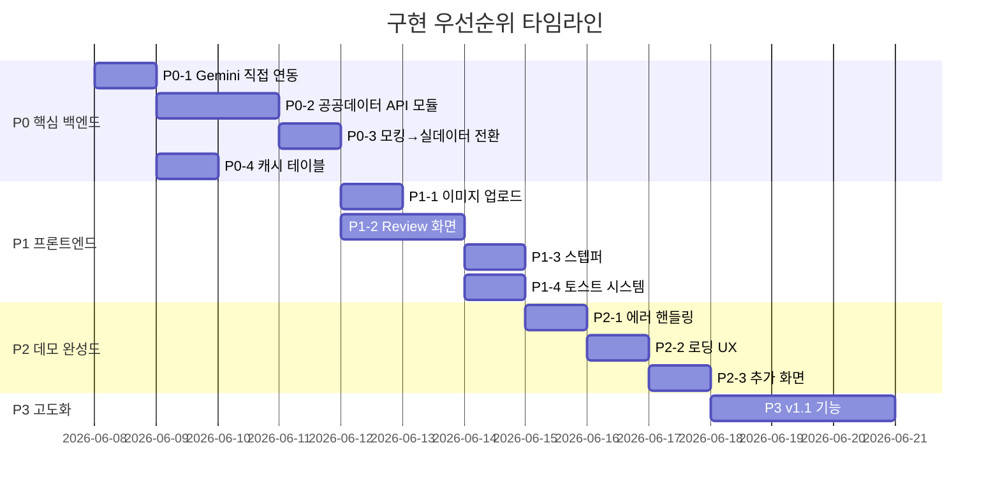

# 직구 세이프패스 AI — 구현 계획

상세서(v2.0) 기준으로 현재 코드베이스를 분석한 GAP 분석 결과와, 앞으로 진행해야 할 작업을 우선순위·순서대로 정리한 문서입니다.

**Active Skills:** concise-planning, senior-fullstack, software-architecture, executing-plans

---

## 현재 구현 상태 요약

### ✅ 구현 완료

| 항목                                 | 파일                                                                                                                                                                                                                                                                                                         | 상태                                |
| ------------------------------------ | ------------------------------------------------------------------------------------------------------------------------------------------------------------------------------------------------------------------------------------------------------------------------------------------------------------ | ----------------------------------- |
| 프로젝트 뼈대                        | TanStack Start + Vite + React 19 + Tailwind v4                                                                                                                                                                                                                                                               | 완료                                |
| 디자인 토큰/색상 팔레트              | [styles.css](file:///c:/Users/dbcdk/Desktop/2026%EB%85%84%20%EA%B4%80%EC%84%B8%EC%B2%AD%20%EA%B3%B5%EA%B3%B5%EB%8D%B0%EC%9D%B4%ED%84%B0%C2%B7AI%20%ED%99%9C%EC%9A%A9%20%EC%B0%BD%EC%97%85%EA%B2%BD%EC%A7%84%EB%8C%80%ED%9A%8C/src/styles.css)                                                                | §7.2 색상 완전 일치                 |
| 폰트 체계                            | Pretendard + Noto Sans KR                                                                                                                                                                                                                                                                                    | §7.3 일치                           |
| shadcn/ui 컴포넌트                   | `src/components/ui/` (34개)                                                                                                                                                                                                                                                                                  | 완료                                |
| 홈 화면 `/`                          | [index.tsx](file:///c:/Users/dbcdk/Desktop/2026%EB%85%84%20%EA%B4%80%EC%84%B8%EC%B2%AD%20%EA%B3%B5%EA%B3%B5%EB%8D%B0%EC%9D%B4%ED%84%B0%C2%B7AI%20%ED%99%9C%EC%9A%A9%20%EC%B0%BD%EC%97%85%EA%B2%BD%EC%A7%84%EB%8C%80%ED%9A%8C/src/routes/index.tsx)                                                           | URL/텍스트 입력, 구매조건, 샘플 3개 |
| 결과 화면 `/scan/:scanId/result`     | [scan.$scanId.result.tsx](file:///c:/Users/dbcdk/Desktop/2026%EB%85%84%20%EA%B4%80%EC%84%B8%EC%B2%AD%20%EA%B3%B5%EA%B3%B5%EB%8D%B0%EC%9D%B4%ED%84%B0%C2%B7AI%20%ED%99%9C%EC%9A%A9%20%EC%B0%BD%EC%97%85%EA%B2%BD%EC%A7%84%EB%8C%80%ED%9A%8C/src/routes/scan.$scanId.result.tsx)                               | 6탭 완전 구현                       |
| 체크리스트 `/scan/:scanId/checklist` | [scan.$scanId.checklist.tsx](file:///c:/Users/dbcdk/Desktop/2026%EB%85%84%20%EA%B4%80%EC%84%B8%EC%B2%AD%20%EA%B3%B5%EA%B3%B5%EB%8D%B0%EC%9D%B4%ED%84%B0%C2%B7AI%20%ED%99%9C%EC%9A%A9%20%EC%B0%BD%EC%97%85%EA%B2%BD%EC%A7%84%EB%8C%80%ED%9A%8C/src/routes/scan.$scanId.checklist.tsx)                         | 토글 + 복사                         |
| RiskBadge                            | [RiskBadge.tsx](file:///c:/Users/dbcdk/Desktop/2026%EB%85%84%20%EA%B4%80%EC%84%B8%EC%B2%AD%20%EA%B3%B5%EA%B3%B5%EB%8D%B0%EC%9D%B4%ED%84%B0%C2%B7AI%20%ED%99%9C%EC%9A%A9%20%EC%B0%BD%EC%97%85%EA%B2%BD%EC%A7%84%EB%8C%80%ED%9A%8C/src/components/RiskBadge.tsx)                                               | §8.4 완전 일치                      |
| Gemini AI 연동                       | [scans.functions.ts](file:///c:/Users/dbcdk/Desktop/2026%EB%85%84%20%EA%B4%80%EC%84%B8%EC%B2%AD%20%EA%B3%B5%EA%B3%B5%EB%8D%B0%EC%9D%B4%ED%84%B0%C2%B7AI%20%ED%99%9C%EC%9A%A9%20%EC%B0%BD%EC%97%85%EA%B2%BD%EC%A7%84%EB%8C%80%ED%9A%8C/src/lib/scans.functions.ts)                                            | Lovable 게이트웨이 경유 Gemini 호출 |
| 위험점수 계산                        | [scan-logic.ts](file:///c:/Users/dbcdk/Desktop/2026%EB%85%84%20%EA%B4%80%EC%84%B8%EC%B2%AD%20%EA%B3%B5%EA%B3%B5%EB%8D%B0%EC%9D%B4%ED%84%B0%C2%B7AI%20%ED%99%9C%EC%9A%A9%20%EC%B0%BD%EC%97%85%EA%B2%BD%EC%A7%84%EB%8C%80%ED%9A%8C/src/lib/scan-logic.ts)                                                      | §16 산식 구현 (모킹 findings 기반)  |
| 세액 계산                            | scan-logic.ts                                                                                                                                                                                                                                                                                                | §17 산식 구현 (모킹 환율)           |
| Supabase scan_cases 테이블           | [마이그레이션](file:///c:/Users/dbcdk/Desktop/2026%EB%85%84%20%EA%B4%80%EC%84%B8%EC%B2%AD%20%EA%B3%B5%EA%B3%B5%EB%8D%B0%EC%9D%B4%ED%84%B0%C2%B7AI%20%ED%99%9C%EC%9A%A9%20%EC%B0%BD%EC%97%85%EA%B2%BD%EC%A7%84%EB%8C%80%ED%9A%8C/supabase/migrations/20260606082535_d130f7ae-c736-4a4a-b3d8-b5035f4c1c6d.sql) | 단일 테이블 + RLS                   |
| 서버 환경변수 구성                   | [config.server.ts](file:///c:/Users/dbcdk/Desktop/2026%EB%85%84%20%EA%B4%80%EC%84%B8%EC%B2%AD%20%EA%B3%B5%EA%B3%B5%EB%8D%B0%EC%9D%B4%ED%84%B0%C2%B7AI%20%ED%99%9C%EC%9A%A9%20%EC%B0%BD%EC%97%85%EA%B2%BD%EC%A7%84%EB%8C%80%ED%9A%8C/src/lib/config.server.ts)                                                | 뼈대만 존재                         |

### ❌ 미구현 / 누락 항목 (GAP)

#### 🔴 Critical — MVP 필수 기능 누락

| #   | 상세서 항목                                         | 현재 상태                                         | 영향                              |
| --- | --------------------------------------------------- | ------------------------------------------------- | --------------------------------- |
| G1  | **공공데이터 API 실제 연동** (§13.2~13.9)           | `generateMockFindings()` — 카테고리 기반 하드코딩 | 대회 핵심 평가 항목               |
| G2  | **관세환율 API 연동** (§13.3)                       | `MOCK_FX` 상수 — 고정값                           | 세액 계산 신뢰성                  |
| G3  | **Gemini 직접 연동** (API Key 기반)                 | Lovable AI Gateway 경유 (`LOVABLE_API_KEY`)       | 독립 배포 불가                    |
| G4  | **이미지 업로드** (§6.1)                            | 홈 화면에 이미지 탭 없음, Supabase Storage 미사용 | MVP 3대 입력 중 1개 누락          |
| G5  | **AI 추출 확인 화면** `/scan/:scanId/review` (§6.3) | 라우트 자체 없음                                  | 사용자 확인 흐름 누락             |
| G6  | **DB 스키마** (§11)                                 | `scan_cases` 1개 테이블만 존재                    | 상세서 12개 테이블 중 11개 미생성 |

#### 🟡 Important — 데모 완성도 관련

| #   | 상세서 항목                                          | 현재 상태               |
| --- | ---------------------------------------------------- | ----------------------- |
| G7  | `/scan/new` 상세 입력 화면 (§6.2)                    | 라우트 없음             |
| G8  | `/compare` 상품 비교 (§6.6)                          | 라우트 없음             |
| G9  | `/history` 진단 이력 (§6.7)                          | 라우트 없음             |
| G10 | 스텝퍼 컴포넌트 (§8.12)                              | 결과 화면에 없음        |
| G11 | 토스트/알림 시스템 (§8.10)                           | sonner 설치됨, 미사용   |
| G12 | 에러/예외 처리 (§19)                                 | catch에서 문자열만 표시 |
| G13 | API 캐시 테이블 + 캐시 정책 (§10.3)                  | 없음                    |
| G14 | `.env`에 `GEMINI_API_KEY`, `DATA_GO_KR_API_KEY` 없음 | Lovable 키만 존재       |

#### ⚪ Nice-to-have — v1.1 범위

| #   | 항목                                     |
| --- | ---------------------------------------- |
| G15 | `/settings` 설정 화면                    |
| G16 | `/admin/api-health` API 상태 관리자 화면 |
| G17 | Supabase Auth 로그인                     |
| G18 | UNI-PASS 화물통관진행정보 연동           |
| G19 | 상품 비교 기능                           |
| G20 | 판매자 신뢰도 보조                       |

---

## User Review Required

> [!IMPORTANT]
> **AI 게이트웨이 전환 필요**: 현재 Lovable AI Gateway(`ai.gateway.lovable.dev`)를 통해 Gemini를 호출합니다. 독립 배포를 위해 **Google AI Studio의 Gemini API Key**로 직접 연동하는 것이 필요합니다. `GEMINI_API_KEY` 환경변수를 발급받으셨는지 확인 부탁드립니다.

> [!IMPORTANT]
> **공공데이터포털 API Key**: 관세청·식약처 공공데이터 API를 실제 호출하려면 `DATA_GO_KR_API_KEY`(인코딩/디코딩 키)가 필요합니다. 발급 상태를 확인해주세요.

> [!WARNING]
> **DB 스키마 확장**: 현재 `scan_cases` 단일 JSONB 컬럼 구조입니다. 상세서 §11의 12테이블 정규화 구조로 전환할지, 아니면 MVP 데모용으로 현재 단일 테이블 + JSONB를 유지할지 결정이 필요합니다. **권장: MVP에서는 현재 구조를 유지하고, 공공데이터 API 캐시용 테이블만 추가합니다.**

---

## Open Questions

> [!IMPORTANT]
>
> 1. **Gemini API Key**를 이미 보유하고 계신가요? (Google AI Studio에서 발급)
> 2. **공공데이터포털 API Key**를 이미 발급받으셨나요? 어떤 API들이 신청 완료 상태인지 알려주세요.
> 3. **Lovable 플랫폼 의존성**: 현재 `@lovable.dev/vite-tanstack-config`과 Lovable AI Gateway를 사용 중입니다. Lovable 플랫폼을 계속 사용할 건가요, 아니면 완전 독립 배포로 전환할 건가요?
> 4. **DB 스키마**: 단일 테이블 유지 vs 정규화 — 어느 방향을 선호하시나요?

---

## Proposed Changes

상세서 §22의 구현 우선순위를 따르되, 현재 이미 구현된 부분을 건너뛰고 GAP 중심으로 재배열합니다.

---

### P0: 핵심 백엔드 — 공공데이터 실연동 + Gemini 직접 연동

> 대회 평가의 **핵심 감점 요인**을 먼저 해결합니다.

---

#### P0-1. 환경변수 및 Gemini 직접 연동 전환

##### [MODIFY] [config.server.ts](file:///c:/Users/dbcdk/Desktop/2026%EB%85%84%20%EA%B4%80%EC%84%B8%EC%B2%AD%20%EA%B3%B5%EA%B3%B5%EB%8D%B0%EC%9D%B4%ED%84%B0%C2%B7AI%20%ED%99%9C%EC%9A%A9%20%EC%B0%BD%EC%97%85%EA%B2%BD%EC%A7%84%EB%8C%80%ED%9A%8C/src/lib/config.server.ts)

- `GEMINI_API_KEY`, `DATA_GO_KR_API_KEY` 환경변수 읽기 추가
- 누락 시 명확한 에러 메시지

##### [MODIFY] [ai-gateway.server.ts](file:///c:/Users/dbcdk/Desktop/2026%EB%85%84%20%EA%B4%80%EC%84%B8%EC%B2%AD%20%EA%B3%B5%EA%B3%B5%EB%8D%B0%EC%9D%B4%ED%84%B0%C2%B7AI%20%ED%99%9C%EC%9A%A9%20%EC%B0%BD%EC%97%85%EA%B2%BD%EC%A7%84%EB%8C%80%ED%9A%8C/src/lib/ai-gateway.server.ts)

- Lovable Gateway → Google `generativelanguage.googleapis.com` 직접 호출로 전환
- `@ai-sdk/google` 패키지 도입 검토 (또는 기존 openai-compatible 유지하되 baseURL 변경)

##### [MODIFY] [scans.functions.ts](file:///c:/Users/dbcdk/Desktop/2026%EB%85%84%20%EA%B4%80%EC%84%B8%EC%B2%AD%20%EA%B3%B5%EA%B3%B5%EB%8D%B0%EC%9D%B4%ED%84%B0%C2%B7AI%20%ED%99%9C%EC%9A%A9%20%EC%B0%BD%EC%97%85%EA%B2%BD%EC%A7%84%EB%8C%80%ED%9A%8C/src/lib/scans.functions.ts)

- `LOVABLE_API_KEY` 의존성 제거
- `GEMINI_API_KEY` 기반으로 전환

##### [MODIFY] .env

- `GEMINI_API_KEY=<사용자 발급 키>` 추가
- `DATA_GO_KR_API_KEY=<공공데이터포털 인코딩 키>` 추가

---

#### P0-2. 공공데이터 API 클라이언트 모듈 생성

##### [NEW] `src/lib/api/customs-api.server.ts`

- **관세청\_세관장확인대상물품(GW)** API 호출 함수 (§13.2)
  - 입력: HS Code, 수출입구분(`I`)
  - 출력: 법령코드, 법령명, 요건기관코드, 요건기관명
  - XML 파싱 포함
- **관세청\_관세환율정보(GW)** API 호출 함수 (§13.3)
  - 입력: `aplyBgnDt`, `weekFxrtTpcd`
  - 출력: 통화별 환율(`fxrt`)
  - 응답 캐싱 (7일)

##### [NEW] `src/lib/api/mfds-api.server.ts`

- **식약처\_수입식품 제품DB** 조회 (§13.7)
  - 입력: 제품명, 품목명, 제조국
  - 출력: 품목분류, 제조국, 관리번호
- **식약처\_수입식품 성분코드** 조회 (§13.8)
  - 입력: 성분 한글/영문명
  - 출력: 성분코드, 사용구분, 이명
- **식약처\_식품 원재료** 조회 (§13.9)
  - 입력: 원재료명
  - 출력: 원재료 정보, GMO 여부

##### [NEW] `src/lib/api/api-helpers.server.ts`

- 공통: XML→JSON 파서, API 타임아웃(10초), 에러 핸들링, 재시도(1회)
- API 호출 로깅 (`public_api_calls` 테이블 또는 JSONB 기록)

---

#### P0-3. scan-logic.ts 모킹 → 실데이터 전환

##### [MODIFY] [scan-logic.ts](file:///c:/Users/dbcdk/Desktop/2026%EB%85%84%20%EA%B4%80%EC%84%B8%EC%B2%AD%20%EA%B3%B5%EA%B3%B5%EB%8D%B0%EC%9D%B4%ED%84%B0%C2%B7AI%20%ED%99%9C%EC%9A%A9%20%EC%B0%BD%EC%97%85%EA%B2%BD%EC%A7%84%EB%8C%80%ED%9A%8C/src/lib/scan-logic.ts)

- `generateMockFindings()` → `generateFindings()` 전환
  - 관세청 세관장확인대상 API 실호출
  - 식약처 API 실호출 (카테고리가 food/health_supplement일 때)
  - API 실패 시 기존 모킹 데이터를 fallback으로 유지 (§19 예외처리)
- `MOCK_FX` → 관세환율 API 실호출 결과로 대체
  - 캐시 히트 시 캐시 사용 (7일)
  - API 실패 시 `MOCK_FX` fallback

##### [MODIFY] [scans.functions.ts](file:///c:/Users/dbcdk/Desktop/2026%EB%85%84%20%EA%B4%80%EC%84%B8%EC%B2%AD%20%EA%B3%B5%EA%B3%B5%EB%8D%B0%EC%9D%B4%ED%84%B0%C2%B7AI%20%ED%99%9C%EC%9A%A9%20%EC%B0%BD%EC%97%85%EA%B2%BD%EC%A7%84%EB%8C%80%ED%9A%8C/src/lib/scans.functions.ts)

- `generateMockFindings` import → 새로운 실데이터 함수로 교체
- evidence 배열에서 `(모킹)` 라벨 제거, 실제 API 호출 결과 기록

---

#### P0-4. API 캐시 테이블 추가

##### [NEW] `supabase/migrations/YYYYMMDD_add_api_cache.sql`

- `api_cache` 테이블 생성:
  ```sql
  CREATE TABLE public.api_cache (
    id UUID PRIMARY KEY DEFAULT gen_random_uuid(),
    api_name TEXT NOT NULL,
    cache_key TEXT NOT NULL,
    response_data JSONB NOT NULL,
    cached_at TIMESTAMPTZ NOT NULL DEFAULT now(),
    expires_at TIMESTAMPTZ NOT NULL,
    UNIQUE(api_name, cache_key)
  );
  ```
- §10.3 캐시 정책: 세관장확인 24h, 관세환율 7d, 식약처 24h

---

#### P0-5. 상품 정보 추출 고도화 (Jina Reader API 도입)

##### [NEW] `src/lib/api/scraper.server.ts`
- Jina Reader API (`https://r.jina.ai/`) 연동
- URL을 입력받아 상품 페이지의 내용을 깔끔한 Markdown 형태로 추출
- Gemini AI 추출 모듈(`scans.functions.ts`)에 전달하여 URL 분석 정확도 및 성공률 극대화

---

#### P0-6. 위해성분 매칭 고도화 (Supabase pgvector)

##### [NEW] `supabase/migrations/YYYYMMDD_add_vector_search.sql`
- `pgvector` 익스텐션 활성화
- `ingredient_vectors` 테이블 생성 (성분명, 이명, 벡터 임베딩 저장)
- 코사인 유사도(Cosine Similarity) 검색용 SQL 함수(`match_ingredients`) 작성

##### [MODIFY] `src/lib/scan-logic.ts`
- 식약처 API 단순 텍스트 검색과 더불어, 추출된 영문 성분명을 pgvector를 통해 의미 기반(Semantic)으로 매칭하여 위해성분 차단 정확도 향상

---

### P1: 프론트엔드 — 누락 화면 + 이미지 업로드

---

#### P1-1. 이미지 업로드 기능 추가

##### [MODIFY] [index.tsx](file:///c:/Users/dbcdk/Desktop/2026%EB%85%84%20%EA%B4%80%EC%84%B8%EC%B2%AD%20%EA%B3%B5%EA%B3%B5%EB%8D%B0%EC%9D%B4%ED%84%B0%C2%B7AI%20%ED%99%9C%EC%9A%A9%20%EC%B0%BD%EC%97%85%EA%B2%BD%EC%A7%84%EB%8C%80%ED%9A%8C/src/routes/index.tsx)

- 3탭 구조로 변경: 텍스트 | URL | **이미지** (§6.1)
- 이미지 드래그&드롭 + 파일 선택 영역 (§8.3 규격)
- 최대 5장, 파일당 10MB 제한
- 미리보기 썸네일 표시

##### [NEW] `src/lib/api/storage.server.ts`

- Supabase Storage에 이미지 업로드
- MIME 타입 + 확장자 검증 (§18.3)
- 업로드 후 publicURL 반환

##### [MODIFY] [scans.functions.ts](file:///c:/Users/dbcdk/Desktop/2026%EB%85%84%20%EA%B4%80%EC%84%B8%EC%B2%AD%20%EA%B3%B5%EA%B3%B5%EB%8D%B0%EC%9D%B4%ED%84%B0%C2%B7AI%20%ED%99%9C%EC%9A%A9%20%EC%B0%BD%EC%97%85%EA%B2%BD%EC%A7%84%EB%8C%80%ED%9A%8C/src/lib/scans.functions.ts)

- 이미지 입력 시 Gemini `Image understanding` 활용 (§13.10)
- base64 또는 URL로 이미지를 Gemini에 전달

---

#### P1-2. AI 추출 확인 화면 `/scan/:scanId/review`

##### [NEW] `src/routes/scan.$scanId.review.tsx`

- §6.3 기반 구현:
  - 좌측: 상품 미리보기, 추출 필드(브랜드/카테고리/성분/용도 등), 신뢰도 표시
  - 우측: HS 후보 3개 + 라디오 선택
  - 사용자가 필드를 수정할 수 있는 인라인 편집
  - "확인 완료" CTA → `/scan/:scanId/result`로 이동
- 진단 흐름 변경: 입력 → **추출 확인** → 결과 (현재: 입력 → 바로 결과)

> [!WARNING]
> 이 화면 추가 시 기존 `createAndAnalyzeScan` 서버 함수의 흐름이 바뀝니다. 현재는 한 번에 분석+저장을 하지만, review 화면을 넣으면 **2단계 흐름**(① 추출+HS후보 생성 → ② 사용자 확인 후 공공데이터 조회+세액계산)으로 분리해야 합니다.

---

#### P1-3. 스텝퍼 컴포넌트

##### [NEW] `src/components/DiagnosisStepper.tsx`

- §8.12 스텝퍼 5단계: 입력 → 추출 → 확인 → 조회 → 결과
- 상태: 완료(체크)/현재(활성)/대기(비활성)/오류
- 결과·리뷰·체크리스트 페이지 상단에 공통 배치

---

#### P1-4. 토스트 알림 시스템 연결

##### [MODIFY] [\_\_root.tsx](file:///c:/Users/dbcdk/Desktop/2026%EB%85%84%20%EA%B4%80%EC%84%B8%EC%B2%AD%20%EA%B3%B5%EA%B3%B5%EB%8D%B0%EC%9D%B4%ED%84%B0%C2%B7AI%20%ED%99%9C%EC%9A%A9%20%EC%B0%BD%EC%97%85%EA%B2%BD%EC%A7%84%EB%8C%80%ED%9A%8C/src/routes/__root.tsx)

- `<Toaster />` (sonner) 추가
- §8.10 위치/시간 규격 적용

---

### P2: 데모 완성도 — 에러 핸들링 + 로딩 UX + 추가 화면

---

#### P2-1. 예외 처리 체계화 (§19)

##### [NEW] `src/lib/error-handler.server.ts`

- 표준 에러 응답 포맷 정의
- API별 실패 시 사용자 메시지 매핑 (§19 테이블)
- 실패한 API를 evidence에 `실패` 상태로 기록

##### [MODIFY] scan-logic.ts, scans.functions.ts

- try-catch 보강, fallback 로직 적용
- API 실패 시 해당 탭 비활성화 (예: 환율 실패 → 세액 탭 비활성)

---

#### P2-2. 로딩/스켈레톤 개선 (§8.13)

##### [MODIFY] 결과 페이지, 리뷰 페이지

- 3줄 skeleton + 단계 문구 (§8.13)
- 8초 초과 시 "조금 더 걸리고 있습니다" 메시지
- 공공데이터 조회 시 API별 완료/실패 progress list

---

#### P2-3. 추가 화면 구현

##### [NEW] `src/routes/scan.new.tsx` — `/scan/new`

- §6.2: 상세 입력 화면 (분석 옵션 포함)
- `include_tax_estimate`, `include_food_safety`, `include_seller_search`, `save_history` 옵션

##### [NEW] `src/routes/history.tsx` — `/history`

- §6.7: 진단 이력 (Supabase에서 `scan_cases` 조회)
- 필터: 기간, 위험등급, 플랫폼

---

### P3: 고도화 — v1.1 기능 (대회 이후 또는 시간 여유 시)

---

#### P3-1. 상품 비교 `/compare`

- §6.6: 2-4개 상품 위험·세액 비교 테이블

#### P3-2. Supabase Auth 로그인

- 이메일/소셜 로그인
- RLS 정책 `user_id = auth.uid()` 적용

#### P3-3. 추가 공공데이터 연동

- 관세청\_품목별 국가별 수출입실적 (§13.5)
- UNI-PASS 화물통관진행정보 (§13.6)

---

## 작업 순서 요약



---

## Verification Plan

### 자동 테스트

```bash
# TypeScript 빌드 확인
bun run build

# Lint 확인
bun run lint
```

### 수동 검증

1. **P0 완료 후**: 샘플 3개(비타민 구미, 무선 이어폰, 티셔츠) 입력 → 실제 공공데이터 API 응답이 evidence 탭에 표시되는지 확인
2. **P1 완료 후**: 이미지 업로드 → Gemini 분석 → review 화면에서 HS 후보 확인 → 결과 화면 전체 흐름 검증
3. **P2 완료 후**: 의도적으로 잘못된 URL 입력, API 키 제거 등 에러 시나리오 테스트

### 대회 데모 시나리오 (§21)

- [ ] 비타민 구미 스크린샷 업로드 → 주의/고위험 결과
- [ ] 무선 이어폰 텍스트 입력 → 주의 결과
- [ ] 의류 티셔츠 → 안전 결과
- [ ] 근거 탭에서 실제 관세청·식약처 API 호출 이력 확인
