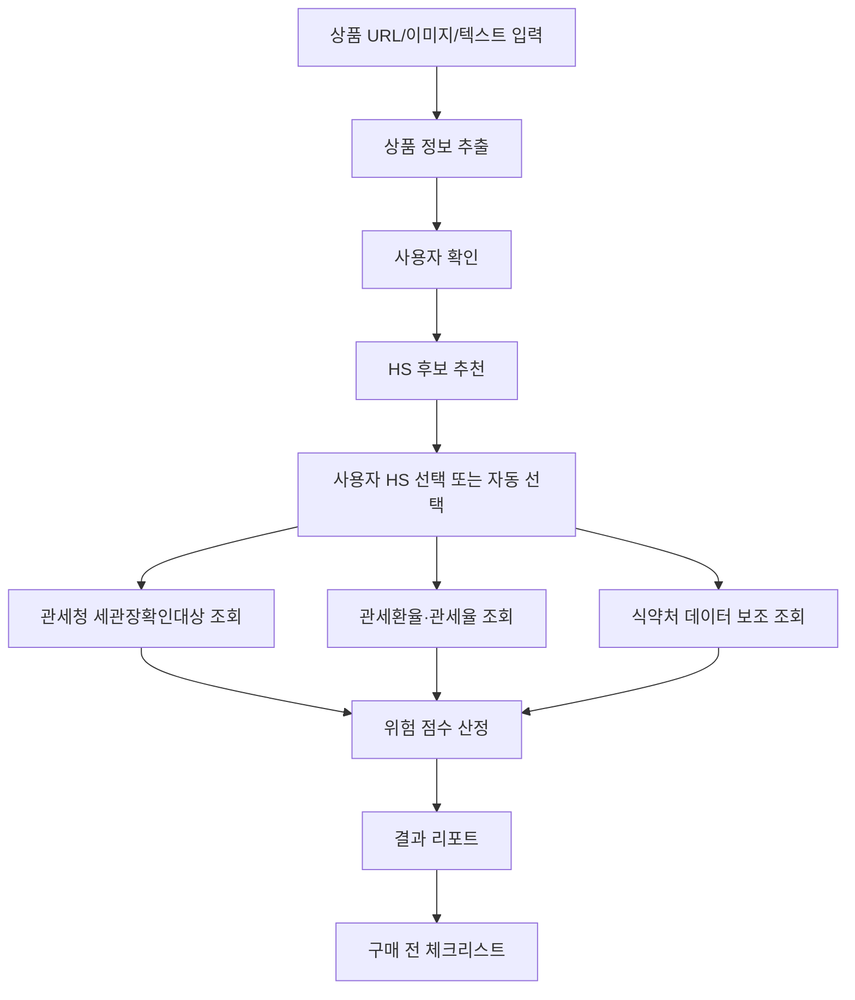
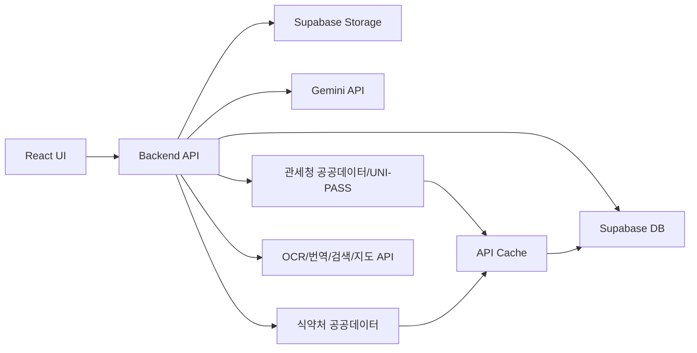

# 직구 세이프패스 AI 상세서

문서 버전: 2.0  
작성일: 2026-06-06  
대상: 2026년 관세청 공공데이터·AI 활용 창업경진대회 제품 및 서비스 개발 부문  
제품명: 직구 세이프패스 AI  
문서 용도: 실제 프로그램 구현을 위한 제품, UI/UX, 백엔드, AI, API 연동 기준 문서

## 목차

1. [프로젝트 개요](#1-프로젝트-개요)
2. [제품 범위](#2-제품-범위)
3. [사용자 정의](#3-사용자-정의)
4. [정보 구조와 라우트](#4-정보-구조와-라우트)
5. [사용자 흐름](#5-사용자-흐름)
6. [화면별 상세 명세](#6-화면별-상세-명세)
7. [서비스 디자인 시스템](#7-서비스-디자인-시스템)
8. [공통 컴포넌트 규격](#8-공통-컴포넌트-규격)
9. [상태값 정의](#9-상태값-정의)
10. [백엔드 아키텍처](#10-백엔드-아키텍처)
11. [Supabase 데이터 모델](#11-supabase-데이터-모델)
12. [내부 API 계약](#12-내부-api-계약)
13. [외부 API 및 공공데이터 연동 명세](#13-외부-api-및-공공데이터-연동-명세)
14. [기능별 구현 가능성 검토](#14-기능별-구현-가능성-검토)
15. [AI 처리 기준](#15-ai-처리-기준)
16. [위험 점수 계산식](#16-위험-점수-계산식)
17. [예상 세액 계산식](#17-예상-세액-계산식)
18. [개인정보 처리 기준](#18-개인정보-처리-기준)
19. [예외 처리 기준](#19-예외-처리-기준)
20. [반응형 기준](#20-반응형-기준)
21. [데모 구성](#21-데모-구성)
22. [구현 우선순위](#22-구현-우선순위)
23. [테스트 기준](#23-테스트-기준)
24. [참고 출처](#24-참고-출처)

## 0. 문서 사용 원칙

이 문서는 `직구 세이프패스 AI`의 단일 기준 문서다. 개발자와 디자이너는 이 문서의 화면 구조, 상태값, API 계약, 계산식, 예외 처리 기준을 우선 적용한다.

서비스는 통관 가능 여부를 확정 판정하지 않는다. 모든 결과 문구는 `위험 진단`, `주의 신호`, `예상 세액`, `확인 필요`로 표현한다. `통관 가능 확정`, `반입 금지 확정`, `세액 확정` 문구는 사용하지 않는다.

관세청 공공데이터 활용 근거는 `관세청_HS부호`, `관세청_세관장확인대상물품(GW)`, `관세청_관세환율정보(GW)`, `관세청_국가별 관세율표`, `UNI-PASS 화물통관진행정보`를 중심으로 한다. 식품, 건강기능식품, 원재료, 성분 위험은 식품의약품안전처 공공데이터를 보조로 사용한다.

## 1. 프로젝트 개요

### 1.1 한 줄 컨셉

해외직구 상품 URL, 이미지, 상세 설명을 넣으면 구매 전에 통관 위험, 목록통관 배제 가능성, 세관장확인 요건, 예상 관부가세를 AI가 진단하는 B2C 해외직구 사전 안전검사 서비스.

### 1.2 해결 문제

일반 소비자는 해외직구 전에 다음 정보를 한 번에 확인하기 어렵다.

| 문제                               | 현재 사용자 행동              | 서비스 해결 방식                                 |
| ---------------------------------- | ----------------------------- | ------------------------------------------------ |
| HS Code를 모름                     | 상품명으로 인터넷 검색        | Gemini가 상품 정보를 구조화하고 HS 후보를 제시   |
| 통관 제한 여부를 모름              | 구매 후 세관 안내를 받고 대응 | 세관장확인대상물품 데이터를 사전 조회            |
| 건강식품, 식품, 화장품 위험을 모름 | 판매자 설명만 믿음            | 식약처 수입식품, 성분, 원재료 데이터를 교차 확인 |
| 예상 세금을 모름                   | 구매 후 고지서를 보고 인지    | 관세환율과 관세율표로 참고용 세액 산출           |
| 상품 상세페이지가 외국어임         | 번역기와 검색을 따로 사용     | 번역, OCR, Gemini 분석을 한 흐름으로 통합        |

### 1.3 핵심 차별성

기존 관세 계산기, 통관조회, HS 검색 서비스는 사용자가 상품 분류와 규정 해석을 직접 해야 한다. 이 서비스는 구매 전 단계에서 상품 URL 또는 이미지를 입력받아 `상품 이해 -> HS 후보 -> 요건 확인 -> 세액 추정 -> 구매 판단`을 하나의 소비자용 흐름으로 제공한다.

### 1.4 공모전 평가 대응

| 평가 관점                | 설계 반영                                                                               |
| ------------------------ | --------------------------------------------------------------------------------------- |
| 관세청 공공데이터 활용도 | HS부호, 세관장확인대상물품, 관세환율, 관세율표, UNI-PASS 데이터를 핵심 판정 근거로 사용 |
| AI 적용성                | Gemini 기반 상품 정보 추출, HS 후보 추천, 위험 사유 요약, 사용자 질문 응답              |
| 시제품 구현 가능성       | MVP는 URL/이미지/텍스트 입력, 위험진단 결과, 세액 추정, 체크리스트까지 구현             |
| 데모 임팩트              | 실제 해외직구 상품 URL 또는 스크린샷을 넣고 `안전/주의/위험` 결과를 즉시 시각화         |
| 차별성                   | 수출 지원, HS 분류 단독, 관세 상담 챗봇과 다르게 B2C 구매 전 사전 리스크 진단에 집중    |
| 시장성                   | 무료 진단 + 프리미엄 리포트 + 개인 셀러용 월 구독 + 제휴 위젯 모델                      |

## 2. 제품 범위

### 2.1 MVP 범위

MVP는 다음 7개 기능만 완성한다.

1. 상품 URL, 상품 설명 텍스트, 상품 이미지 업로드 입력
2. Gemini 기반 상품명, 브랜드, 가격, 원산지, 성분, 용도, 수량, 플랫폼 추출
3. HS Code 후보 3개 추천 및 사용자 확인
4. 세관장확인대상물품 조회 기반 요건 위험 진단
5. 식약처 공공데이터 기반 식품·성분·원재료 위험 보조 진단
6. 관세환율과 관세율표 기반 참고용 예상 세액 산출
7. 소비자용 결과 리포트와 구매 전 체크리스트 제공

### 2.2 v1.1 범위

| 기능               | 설명                                                                                |
| ------------------ | ----------------------------------------------------------------------------------- |
| 상품 비교          | 2개 이상 상품의 통관 위험, 예상 세액, 요건 차이를 비교                              |
| 통관 이후 조회     | 송장번호, MBL/HBL, 화물관리번호 입력 시 UNI-PASS 화물통관진행정보 연결              |
| 판매자 신뢰도 보조 | 검색 API 또는 URL Context로 판매자 페이지, 후기, 리콜 키워드 요약                   |
| 세관/기관 안내     | Google Places 또는 Kakao 지도 API로 가까운 세관, 식약처 기관, 소비자 상담 위치 안내 |

### 2.3 v2 제외 범위

| 제외 항목                    | 제외 사유                                                                 |
| ---------------------------- | ------------------------------------------------------------------------- |
| 통관 가능 여부 확정 판정     | 세관 및 관계기관의 권한 영역                                              |
| 수입신고 자동 대행           | 관세사, 통관대행, 본인인증, 전자서명 이슈 필요                            |
| 법적 효력 있는 세액 산출     | 실제 세액은 통관 시점, 신고가격, 운임, 보험료, 세율에 따라 달라짐         |
| 모든 해외 쇼핑몰 자동 크롤링 | 로그인, 동적 페이지, 약관, 차단 이슈 존재                                 |
| 개인통관고유부호 저장        | MVP에서는 저장하지 않고, v1.1에서도 사용자가 명시 동의한 경우만 일시 처리 |

## 3. 사용자 정의

### 3.1 핵심 사용자

| 사용자               | 상황                                                | 필요한 결과                                 |
| -------------------- | --------------------------------------------------- | ------------------------------------------- |
| 일반 해외직구 소비자 | AliExpress, Temu, Amazon, iHerb 등에서 구매 전 확인 | 사도 되는지, 세금이 붙는지, 서류가 필요한지 |
| 초보 개인 셀러       | 해외 상품을 소량 구매해 국내 판매 검토              | 판매용 수입신고 필요성, 인증·요건 위험      |
| 구매대행 운영자      | 고객 문의 상품의 통관 리스크 확인                   | 빠른 위험 리포트와 고객 안내 문구           |

### 3.2 핵심 사용자 시나리오

1. 사용자가 해외 쇼핑몰 상품 URL을 붙여 넣는다.
2. URL 접근이 실패하면 상품 스크린샷 또는 상세 설명 텍스트를 업로드한다.
3. 서비스가 Gemini로 상품 정보를 추출한다.
4. 사용자가 추출 결과와 HS 후보를 확인한다.
5. 서비스가 관세청, 식약처 데이터를 조회한다.
6. 서비스가 위험등급, 위험 사유, 예상 세액, 체크리스트를 표시한다.
7. 사용자는 `구매 가능성 낮음`, `주의 후 구매`, `관세사/기관 확인 필요` 중 하나의 행동 권고를 받는다.

## 4. 정보 구조와 라우트

| 라우트                    | 화면명             | 접근 조건    | 목적                                |
| ------------------------- | ------------------ | ------------ | ----------------------------------- |
| `/`                       | 진단 시작 화면     | 공개         | 상품 입력과 최근 샘플 결과 표시     |
| `/scan/new`               | 새 진단            | 공개         | URL, 이미지, 텍스트, 가격 정보 입력 |
| `/scan/:scanId/review`    | AI 추출 확인       | 진단 생성 후 | 상품 정보와 HS 후보 확인            |
| `/scan/:scanId/result`    | 진단 결과          | 분석 완료 후 | 위험등급, 세액, 요건, 근거 표시     |
| `/scan/:scanId/checklist` | 구매 전 체크리스트 | 분석 완료 후 | 구매 전 확인 항목과 필요 서류 표시  |
| `/compare`                | 상품 비교          | 로그인 선택  | 여러 상품의 위험과 세액 비교        |
| `/history`                | 진단 이력          | 로그인       | 이전 진단 검색, 재분석              |
| `/settings`               | 설정               | 로그인       | 알림, 데이터 보관, API 동의 관리    |
| `/admin/api-health`       | API 상태           | 관리자       | 공공데이터 API 상태와 캐시 확인     |

## 5. 사용자 흐름



## 6. 화면별 상세 명세

### 6.1 진단 시작 화면 `/`

목적: 첫 화면에서 바로 상품 진단을 시작하게 한다. 랜딩페이지식 홍보 화면이 아니라 실제 입력 화면이 첫 화면이어야 한다.

레이아웃:

| 항목        |                        Desktop |    Mobile |
| ----------- | -----------------------------: | --------: |
| 전체 폭     | `max-width: 1180px`, 중앙 정렬 |    `100%` |
| 좌우 패딩   |                         `32px` |    `20px` |
| 상단바 높이 |                         `64px` |    `56px` |
| 메인 그리드 |                      `7fr 5fr` | 단일 컬럼 |
| 기본 간격   |                         `24px` |    `16px` |

구성:

| 영역           | 구성 요소                                   | 규격                                          |
| -------------- | ------------------------------------------- | --------------------------------------------- |
| 상단바         | 로고, 이력, 설정                            | 로고 텍스트 `직구 세이프패스 AI`, 높이 `64px` |
| 입력 패널      | URL 입력, 이미지 업로드, 텍스트 입력 탭     | 패널 radius `8px`, border `#D8DED7`           |
| 상품 조건      | 구매국가, 통화, 상품가격, 배송비, 구매 목적 | 2열 입력, 모바일 1열                          |
| 빠른 결과 샘플 | 3개 샘플 상품                               | `안전`, `주의`, `위험` 상태 예시              |
| 법적 고지      | 결과는 참고용                               | 본문 하단 고정, 13px                          |

필수 입력:

| 필드               | 타입              | 필수   | 예시                              |
| ------------------ | ----------------- | ------ | --------------------------------- |
| `input_type`       | enum              | 필수   | `url`, `image`, `text`            |
| `product_url`      | URL               | 조건부 | `https://www.amazon.com/...`      |
| `product_images`   | file[]            | 조건부 | `.png`, `.jpg`, `.webp`, 최대 5장 |
| `product_text`     | textarea          | 조건부 | 상품명, 상세 설명, 성분           |
| `purchase_country` | select            | 필수   | `US`, `CN`, `JP`, `EU`, `UNKNOWN` |
| `currency`         | select            | 필수   | `USD`, `JPY`, `CNY`, `EUR`, `KRW` |
| `item_price`       | number            | 필수   | `129.99`                          |
| `shipping_fee`     | number            | 선택   | `15.00`                           |
| `purchase_purpose` | segmented control | 필수   | `personal`, `resale`              |

CTA:

| 버튼                | 조건            | 동작                           |
| ------------------- | --------------- | ------------------------------ |
| `진단 시작`         | 필수 입력 충족  | `/scan/:scanId/review`로 이동  |
| `이미지만으로 진단` | 이미지 1장 이상 | OCR/Gemini 이미지 분석 실행    |
| `샘플 결과 보기`    | 항상            | 샘플 `scanId` 결과 페이지 열기 |

### 6.2 새 진단 화면 `/scan/new`

목적: 첫 화면 입력보다 상세한 정보를 입력한다.

섹션:

1. 상품 정보 입력
2. 구매 조건 입력
3. 개인 사용 여부 입력
4. 분석 옵션 선택

분석 옵션:

| 옵션                    | 기본값 | 설명                           |
| ----------------------- | ------ | ------------------------------ |
| `include_tax_estimate`  | true   | 관부가세 참고 계산             |
| `include_food_safety`   | true   | 식품·건기식·성분 데이터 조회   |
| `include_seller_search` | false  | 판매자/상품 검색 보조 분석     |
| `save_history`          | false  | 로그인 사용자의 진단 이력 저장 |

입력 검증:

| 검증        | 기준                 | 오류 메시지                                         |
| ----------- | -------------------- | --------------------------------------------------- |
| URL         | `https://`로 시작    | `공개 접근 가능한 상품 URL을 입력하세요.`           |
| 이미지 크기 | 파일당 10MB 이하     | `이미지는 파일당 10MB 이하만 업로드할 수 있습니다.` |
| 가격        | 0보다 큼             | `상품 가격을 입력하세요.`                           |
| 통화        | 지원 통화 중 하나    | `지원되는 통화를 선택하세요.`                       |
| 구매 목적   | `personal`, `resale` | `구매 목적을 선택하세요.`                           |

### 6.3 AI 추출 확인 화면 `/scan/:scanId/review`

목적: AI 추출 결과를 사용자가 확인하고 잘못된 필드를 수정한다.

좌측 영역:

| 구성          | 표시 항목                                                          |
| ------------- | ------------------------------------------------------------------ |
| 상품 미리보기 | 대표 이미지, 원문 상품명, 번역 상품명                              |
| 추출 필드     | 브랜드, 모델명, 카테고리, 용도, 재질, 성분, 수량, 원산지, 구매국가 |
| 신뢰도        | `high`, `medium`, `low`                                            |

우측 영역:

| 구성           | 표시 항목                                                  |
| -------------- | ---------------------------------------------------------- |
| HS 후보 리스트 | 후보 3개, HS 코드, 한글 품명, 영문 품명, 추천 이유, 신뢰도 |
| 근거           | 상품명 키워드, 성분, 재질, 용도                            |
| 사용자 선택    | 라디오 버튼                                                |

HS 후보 행 규격:

| 항목        | 규격                                   |
| ----------- | -------------------------------------- |
| 행 높이     | 최소 `84px`                            |
| HS 코드     | 10자리 우선, 없으면 6자리              |
| 신뢰도 표시 | `0.00`부터 `1.00`                      |
| 선택 상태   | border `#0F766E`, background `#E6F4F1` |

필수 완료 조건:

1. 상품명 확정
2. 상품 카테고리 확정
3. HS 후보 1개 이상 선택
4. 구매 목적 확정
5. 가격과 통화 확정

### 6.4 진단 결과 화면 `/scan/:scanId/result`

목적: 구매 전 의사결정을 위한 핵심 결과를 1분 안에 이해시키는 화면.

상단 요약:

| 영역       | 내용                                                                             |
| ---------- | -------------------------------------------------------------------------------- |
| 위험등급   | `안전`, `주의`, `고위험`, `확인불가`                                             |
| 한 줄 결론 | 예: `건강기능식품 가능성이 있어 목록통관 배제 및 식약처 요건 확인이 필요합니다.` |
| 예상 세액  | 참고용 원화 금액, 계산 근거                                                      |
| 행동 권고  | `구매 전 확인`, `판매자에 성분표 요청`, `관세사 상담`, `구매 보류`               |

탭 구조:

| 탭        | 내용                                          |
| --------- | --------------------------------------------- |
| 요약      | 위험등급, 핵심 사유, 권고                     |
| 통관요건  | 세관장확인대상 조회 결과, 관련 법령, 요건기관 |
| 예상세액  | 환율, 과세가격, 관세, 부가세, 계산식          |
| 식품·성분 | 식약처 제품DB, 성분코드, 원재료 결과          |
| 근거      | 사용한 API, 응답값, 캐시 시각                 |
| 다음 단계 | 구매 전 체크리스트, 문의 문구                 |

위험등급 표시:

| 등급              |   점수 | 색상      | 문구                     |
| ----------------- | -----: | --------- | ------------------------ |
| `safe`            |   0-29 | `#138A61` | `낮은 위험`              |
| `caution`         |  30-59 | `#B7791F` | `주의 필요`              |
| `high_risk`       |  60-79 | `#C2410C` | `통관 리스크 높음`       |
| `blocked_unknown` | 80-100 | `#B91C1C` | `구매 전 기관 확인 필요` |

결과 카드 규격:

| 항목        | 규격                          |
| ----------- | ----------------------------- |
| 카드 radius | `8px`                         |
| 내부 패딩   | `20px` desktop, `16px` mobile |
| 제목 크기   | `16px`, weight `700`          |
| 본문 크기   | `14px`, line-height `1.55`    |
| 근거 링크   | 항상 API명과 조회시각 표시    |

### 6.5 구매 전 체크리스트 `/scan/:scanId/checklist`

목적: 사용자가 구매 전에 판매자에게 확인하거나 준비해야 할 항목을 실행 가능한 목록으로 제공한다.

체크리스트 항목 구조:

| 필드        | 예시                                                   |
| ----------- | ------------------------------------------------------ |
| 제목        | `성분표 원문 확보`                                     |
| 이유        | `식품·건강기능식품으로 분류될 경우 목록통관 배제 가능` |
| 필요한 자료 | `영문 성분표`, `제품 라벨 이미지`                      |
| 완료 조건   | `성분명과 함량이 보이는 이미지 업로드`                 |
| 상태        | `todo`, `done`, `not_applicable`                       |

기본 체크리스트:

1. 상품명과 모델명이 상세페이지와 일치하는지 확인
2. 성분표 또는 원재료명 확보
3. 개인 사용 목적 여부 확인
4. 구매 수량이 자가사용 범위에 맞는지 확인
5. 목록통관 배제 품목 가능성 확인
6. 세관장확인대상 결과가 있으면 관계기관 요건 확인
7. 예상 세액이 상품가격 대비 과도한지 확인

### 6.6 상품 비교 화면 `/compare`

목적: 소비자가 비슷한 상품 중 통관 리스크가 낮은 대안을 선택하게 한다.

비교 항목:

| 항목            | 표시 방식          |
| --------------- | ------------------ |
| 상품명          | 2-4열 비교         |
| 위험등급        | 색상 배지          |
| HS 후보         | 코드 + 품명        |
| 세관장확인 여부 | 있음/없음/확인불가 |
| 식품·성분 위험  | 낮음/주의/높음     |
| 예상 세액       | 원화               |
| 추천 순위       | `1순위`, `2순위`   |

### 6.7 진단 이력 `/history`

목적: 로그인 사용자가 이전 진단을 다시 확인하고 재분석한다.

필터:

| 필터      | 값                                    |
| --------- | ------------------------------------- |
| 기간      | 7일, 30일, 90일                       |
| 위험등급  | 전체, 안전, 주의, 고위험              |
| 플랫폼    | Amazon, AliExpress, Temu, iHerb, 기타 |
| 저장 상태 | 저장됨, 만료 예정                     |

데이터 보관:

| 사용자 유형 | 기본 보관 기간 |
| ----------- | -------------: |
| 비로그인    |         24시간 |
| 로그인 무료 |           30일 |
| 프리미엄    |            1년 |

## 7. 서비스 디자인 시스템

### 7.1 디자인 방향

서비스는 소비자용이지만 세관·통관 정보를 다루므로 과도한 장식보다 신뢰성과 판독성을 우선한다. 첫 화면은 실제 진단 도구여야 하며 마케팅형 히어로 섹션을 만들지 않는다.

### 7.2 색상 팔레트

| 토큰                   | 값        | 용도                 |
| ---------------------- | --------- | -------------------- |
| `--color-bg`           | `#F6F7F4` | 전체 배경            |
| `--color-surface`      | `#FFFFFF` | 패널, 모달           |
| `--color-text`         | `#121417` | 기본 텍스트          |
| `--color-muted`        | `#667085` | 보조 텍스트          |
| `--color-border`       | `#D8DED7` | 경계선               |
| `--color-primary`      | `#0F766E` | 주요 버튼, 선택 상태 |
| `--color-primary-weak` | `#E6F4F1` | 선택 배경            |
| `--color-safe`         | `#138A61` | 안전                 |
| `--color-caution`      | `#B7791F` | 주의                 |
| `--color-risk`         | `#C2410C` | 고위험               |
| `--color-danger`       | `#B91C1C` | 제한 가능성          |
| `--color-info`         | `#2563EB` | 정보                 |

사용 제한:

1. 그라디언트 배경 사용 금지
2. 보라색·남색 단일 팔레트 지배 금지
3. 상태 색상은 의미가 있는 곳에만 사용
4. 카드 그림자는 `0 1px 2px rgba(16, 24, 40, 0.08)` 이하

### 7.3 폰트 체계

| 용도          | 폰트                                        | 크기 | 굵기 | 줄간격 |
| ------------- | ------------------------------------------- | ---: | ---: | -----: |
| Display       | Pretendard, Noto Sans KR, sans-serif        | 32px |  700 |   1.25 |
| Page title    | Pretendard                                  | 24px |  700 |    1.3 |
| Section title | Pretendard                                  | 18px |  700 |   1.35 |
| Card title    | Pretendard                                  | 16px |  700 |    1.4 |
| Body          | Pretendard                                  | 14px |  400 |   1.55 |
| Caption       | Pretendard                                  | 12px |  400 |   1.45 |
| Code/Data     | `ui-monospace`, `SFMono-Regular`, monospace | 13px |  500 |    1.4 |

규칙:

1. viewport 기반 폰트 크기 사용 금지
2. letter-spacing은 `0`
3. 버튼 텍스트는 1줄을 원칙으로 하되 모바일에서 줄바꿈 허용
4. 긴 HS 품명은 2줄까지만 표시하고 전체 텍스트는 tooltip에서 제공

### 7.4 레이아웃 규칙

| 기준               | 값                            |
| ------------------ | ----------------------------- |
| Desktop breakpoint | `1200px 이상`                 |
| Tablet breakpoint  | `768px-1199px`                |
| Mobile breakpoint  | `767px 이하`                  |
| Desktop max width  | `1180px`                      |
| Desktop grid       | 12 columns, gap `24px`        |
| Tablet grid        | 8 columns, gap `20px`         |
| Mobile grid        | 4 columns, gap `16px`         |
| Section gap        | `32px` desktop, `24px` mobile |
| Component gap      | `12px`                        |
| Radius             | 기본 `8px`, 작은 요소 `6px`   |

### 7.5 접근성 원칙

| 항목      | 기준                                          |
| --------- | --------------------------------------------- |
| 대비      | 본문 텍스트 WCAG AA 4.5:1 이상                |
| 키보드    | 모든 입력, 탭, 모달, 버튼은 키보드 접근 가능  |
| 포커스    | `2px solid #2563EB`, offset `2px`             |
| 상태 색상 | 색상만으로 의미 전달 금지, 텍스트 라벨 동반   |
| 이미지    | 업로드 이미지 미리보기에는 파일명과 alt 제공  |
| 모달      | 열릴 때 첫 포커스 이동, 닫힐 때 트리거로 복귀 |
| 로딩      | 5초 이상이면 진행 단계 문구 표시              |

## 8. 공통 컴포넌트 규격

### 8.1 버튼

| 종류      | 높이 | 배경      | 텍스트    | 사용                     |
| --------- | ---: | --------- | --------- | ------------------------ |
| Primary   | 44px | `#0F766E` | `#FFFFFF` | 진단 시작, 분석 실행     |
| Secondary | 44px | `#FFFFFF` | `#121417` | 샘플 보기, 뒤로          |
| Danger    | 44px | `#B91C1C` | `#FFFFFF` | 삭제, 보관 종료          |
| Icon      | 40px | `#FFFFFF` | icon      | 새로고침, 복사, 다운로드 |

버튼 상태:

| 상태     | 규칙                                 |
| -------- | ------------------------------------ |
| hover    | background를 6% 어둡게               |
| disabled | opacity `0.45`, cursor `not-allowed` |
| loading  | spinner + `분석 중` 텍스트           |

아이콘은 lucide-react를 우선 사용한다. 텍스트만 있는 아이콘성 버튼은 만들지 않는다.

### 8.2 입력창

| 항목        | 규격                |
| ----------- | ------------------- |
| 높이        | 44px                |
| border      | `1px solid #D8DED7` |
| radius      | 8px                 |
| padding     | `0 12px`            |
| 오류 border | `#B91C1C`           |
| 도움말      | 12px, `#667085`     |

### 8.3 업로드 영역

| 항목      | 규격                            |
| --------- | ------------------------------- |
| 높이      | desktop `180px`, mobile `150px` |
| border    | `1px dashed #98A2B3`            |
| radius    | 8px                             |
| 허용 파일 | png, jpg, jpeg, webp, pdf       |
| 최대 개수 | 5개                             |
| 최대 크기 | 파일당 10MB                     |

### 8.4 위험 배지

| 상태     | 배경      | 텍스트    | 아이콘          |
| -------- | --------- | --------- | --------------- |
| 안전     | `#E7F7EF` | `#138A61` | `CheckCircle`   |
| 주의     | `#FFF4D6` | `#B7791F` | `AlertTriangle` |
| 고위험   | `#FFE8D9` | `#C2410C` | `CircleAlert`   |
| 확인불가 | `#FEE2E2` | `#B91C1C` | `ShieldAlert`   |

### 8.5 근거 행

모든 결과는 근거 행을 포함한다.

| 필드      | 표시 예시                                   |
| --------- | ------------------------------------------- |
| 데이터명  | `관세청_세관장확인대상물품(GW)`             |
| 입력값    | `HS 2106909099, 수입`                       |
| 응답 요약 | `수입식품안전관리 특별법, 식품의약품안전처` |
| 조회시각  | `2026-06-06 14:20 KST`                      |
| 신뢰도    | `확정 데이터`, `참고 데이터`, `AI 추정`     |

### 8.6 카드

카드는 반복 항목, 결과 요약, 선택 가능한 후보에만 사용한다. 페이지 전체 섹션을 카드처럼 띄우지 않는다.

| 카드 종류       | 사용 위치              |                  폭/높이 | 내부 패딩 | border                     | radius |
| --------------- | ---------------------- | -----------------------: | --------: | -------------------------- | -----: |
| `SummaryCard`   | 결과 상단 요약         | 부모 폭 100%, 최소 128px |      20px | `1px solid #D8DED7`        |    8px |
| `CandidateCard` | HS 후보 목록           |  부모 폭 100%, 최소 84px |      16px | 선택 시 `#0F766E`          |    8px |
| `FindingCard`   | 통관요건·식품성분 근거 |             부모 폭 100% |      16px | 위험등급별 좌측 4px border |    8px |
| `MetricCard`    | 예상세액 세부 수치     |  desktop 4열, mobile 1열 |      16px | `#D8DED7`                  |    8px |

카드 내부 배치:

| 영역      | 규칙                                            |
| --------- | ----------------------------------------------- |
| 제목      | 16px, 700, 최대 2줄                             |
| 부제      | 13px, `#667085`, 최대 2줄                       |
| 본문      | 14px, 줄간격 1.55                               |
| 하단 액션 | 우측 정렬, 버튼 간격 8px                        |
| 선택 카드 | 라디오/체크박스는 좌측 상단, 텍스트와 12px 간격 |

### 8.7 모달

모달은 샘플 리포트, API 근거 상세, 삭제 확인, 오류 상세에만 사용한다. 일반 입력 흐름은 모달 대신 페이지 또는 drawer를 사용한다.

| 모달 종류           |    폭 | 최대 높이 | 사용 조건                    |
| ------------------- | ----: | --------: | ---------------------------- |
| `ConfirmDialog`     | 420px | 내용 기준 | 삭제, 보관 종료, 재분석 확인 |
| `EvidenceModal`     | 720px |    `80vh` | API 요청·응답 원문 보기      |
| `SampleReportModal` | 860px |    `84vh` | 샘플 결과 보기               |
| `ErrorDetailModal`  | 640px |    `72vh` | 실패 원인, 재시도 방법 표시  |

모달 공통 규칙:

| 항목     | 규칙                                               |
| -------- | -------------------------------------------------- |
| 배경 dim | `rgba(18, 20, 23, 0.48)`                           |
| 표면     | `#FFFFFF`, radius 8px                              |
| 헤더     | 높이 56px, 좌우 20px, 하단 border                  |
| 본문     | padding 20px, overflow-y auto                      |
| 푸터     | 높이 64px, 우측 버튼 정렬, gap 8px                 |
| 닫기     | ESC, dim 클릭, 닫기 아이콘 모두 지원               |
| 접근성   | `role="dialog"`, `aria-modal="true"`, 제목 id 연결 |

### 8.8 탭

결과 화면의 `요약`, `통관요건`, `예상세액`, `식품·성분`, `근거`, `다음 단계`는 탭으로 구현한다.

| 항목         | 규격                                  |
| ------------ | ------------------------------------- |
| 높이         | 44px                                  |
| desktop 배치 | 가로 탭, gap 4px                      |
| mobile 배치  | 가로 스크롤 탭, scrollbar 숨김        |
| 선택 상태    | 하단 2px border `#0F766E`, 텍스트 700 |
| 비활성 탭    | opacity 0.45, 클릭 불가               |
| URL 상태     | `?tab=tax` 형식으로 유지              |

탭 id:

| id           | 라벨      |
| ------------ | --------- |
| `summary`    | 요약      |
| `compliance` | 통관요건  |
| `tax`        | 예상세액  |
| `food`       | 식품·성분 |
| `evidence`   | 근거      |
| `next`       | 다음 단계 |

### 8.9 테이블

API 근거, 세액 계산, 진단 이력은 테이블로 표시한다.

| 항목       | 규격                                    |
| ---------- | --------------------------------------- |
| 헤더 높이  | 40px                                    |
| 행 높이    | 최소 48px                               |
| 셀 padding | `10px 12px`                             |
| 헤더 배경  | `#EEF2F0`                               |
| 행 border  | `1px solid #E5E7EB`                     |
| 숫자 정렬  | 우측 정렬                               |
| 코드 정렬  | monospace, 좌측 정렬                    |
| mobile     | 핵심 2열만 표시하고 나머지는 row expand |

테이블 빈 상태:

| 상황           | 문구                                         |
| -------------- | -------------------------------------------- |
| 조회 결과 없음 | `조회된 공공데이터 결과가 없습니다.`         |
| API 실패       | `API 조회 실패로 결과를 표시할 수 없습니다.` |
| 필터 결과 없음 | `조건에 맞는 진단 이력이 없습니다.`          |

### 8.10 토스트와 알림

토스트는 저장, 복사, 재시도, API 실패 같은 순간 상태만 표시한다.

| 종류    | 아이콘          | 배경      |                        표시 시간 |
| ------- | --------------- | --------- | -------------------------------: |
| success | `CheckCircle`   | `#E7F7EF` |                           3000ms |
| info    | `Info`          | `#EFF6FF` |                           3000ms |
| warning | `AlertTriangle` | `#FFF4D6` |                           5000ms |
| error   | `CircleAlert`   | `#FEE2E2` | 사용자가 닫을 때까지 또는 7000ms |

위치:

| viewport | 위치                                |
| -------- | ----------------------------------- |
| desktop  | 우측 상단, top 80px, right 24px     |
| mobile   | 하단 sticky CTA 위, left/right 16px |

### 8.11 툴팁

툴팁은 HS Code, 관세환율, 세관장확인대상, AI 신뢰도처럼 사용자가 모를 수 있는 짧은 용어 설명에만 사용한다.

| 항목      | 규격                           |
| --------- | ------------------------------ |
| 최대 폭   | 320px                          |
| padding   | `8px 10px`                     |
| 배경      | `#121417`                      |
| 텍스트    | `#FFFFFF`, 12px                |
| 표시 지연 | hover 300ms                    |
| mobile    | long press 또는 info 버튼 클릭 |

### 8.12 스텝퍼

진단 흐름 상단에는 5단계 스텝퍼를 표시한다.

| 순서 | id        | 라벨 | 완료 조건                           |
| ---: | --------- | ---- | ----------------------------------- |
|    1 | `input`   | 입력 | 필수 입력 완료                      |
|    2 | `extract` | 추출 | Gemini 구조화 결과 생성             |
|    3 | `review`  | 확인 | 사용자 필드 확인                    |
|    4 | `check`   | 조회 | 공공데이터 조회 완료 또는 실패 기록 |
|    5 | `result`  | 결과 | 위험 리포트 생성                    |

상태:

| 상태 | 표시                                |
| ---- | ----------------------------------- |
| 완료 | 원형 check 아이콘, `#0F766E`        |
| 현재 | 원형 border `#0F766E`, 굵은 텍스트  |
| 대기 | 원형 border `#D8DED7`, muted 텍스트 |
| 오류 | 원형 `AlertTriangle`, `#B91C1C`     |

### 8.13 로딩, 스켈레톤, 빈 상태

| 위치            | 로딩 방식                | 최대 대기 안내                    |
| --------------- | ------------------------ | --------------------------------- |
| 상품 추출       | 3줄 skeleton + 단계 문구 | 8초 후 `조금 더 걸리고 있습니다.` |
| 공공데이터 조회 | progress list            | API별 완료/실패 표시              |
| 결과 리포트     | 카드 skeleton 3개        | 10초 후 재시도 버튼               |
| 이미지 OCR      | 업로드 썸네일 위 spinner | 8초 후 이미지 품질 안내           |

빈 상태 구성:

| 화면      | 아이콘        | 제목                         | 보조 문구                                          | CTA              |
| --------- | ------------- | ---------------------------- | -------------------------------------------------- | ---------------- |
| 이력 없음 | `FileSearch`  | `아직 진단 이력이 없습니다.` | `상품 URL이나 이미지를 넣어 첫 진단을 시작하세요.` | `진단 시작`      |
| 비교 없음 | `GitCompare`  | `비교할 상품이 없습니다.`    | `결과 화면에서 비교 목록에 추가할 수 있습니다.`    | `샘플 비교 보기` |
| 근거 없음 | `DatabaseZap` | `조회된 근거가 없습니다.`    | `입력값이 부족하거나 API 조회가 실패했습니다.`     | `입력 보완`      |

### 8.14 폼 오류와 검증 메시지

| 오류 유형      | 표시 위치      | 규칙                           |
| -------------- | -------------- | ------------------------------ |
| 필수 누락      | 필드 하단      | `이 항목은 필수입니다.`        |
| 형식 오류      | 필드 하단      | URL, 숫자, 통화 형식 구체 표시 |
| 서버 오류      | 폼 상단 alert  | API명, 재시도 버튼 포함        |
| AI 신뢰도 낮음 | 해당 섹션 상단 | `AI 추출값을 확인하세요.`      |

오류 메시지는 60자 이내로 작성한다. 법적 판단을 암시하는 문구는 사용하지 않는다.

### 8.15 컴포넌트 명명 기준

프론트엔드 구현 시 컴포넌트는 도메인 의미를 포함해 명명한다. `CommonCard`, `UtilModal` 같은 범용명은 사용하지 않는다.

| 컴포넌트                | 책임                            |
| ----------------------- | ------------------------------- |
| `ProductInputPanel`     | URL, 이미지, 텍스트 입력        |
| `PurchaseConditionForm` | 구매국가, 통화, 가격, 목적 입력 |
| `ExtractionReviewPanel` | AI 추출값 확인·수정             |
| `HsCandidateList`       | HS 후보 표시와 선택             |
| `RiskSummaryCard`       | 최종 위험등급 표시              |
| `ComplianceFindingList` | 세관장확인·식약처 근거 표시     |
| `TaxEstimateBreakdown`  | 세액 계산식과 수치 표시         |
| `EvidenceDetailModal`   | API 요청·응답 근거 상세         |
| `PrePurchaseChecklist`  | 구매 전 체크리스트              |

## 9. 상태값 정의

### 9.1 진단 상태

| 상태 코드              | 화면 표시          | 의미                          | 다음 동작 |
| ---------------------- | ------------------ | ----------------------------- | --------- |
| `draft`                | 작성 중            | 입력이 저장됐지만 분석 전     | 입력 완료 |
| `input_ready`          | 분석 준비          | 필수 입력 충족                | 추출 실행 |
| `extracting`           | 상품 정보 추출 중  | Gemini/OCR 처리 중            | 대기      |
| `review_required`      | 확인 필요          | AI 추출 결과 사용자 확인 필요 | 수정/확정 |
| `classifying_hs`       | HS 후보 생성 중    | HS 후보 계산                  | 대기      |
| `checking_public_data` | 공공데이터 조회 중 | 관세청·식약처 조회            | 대기      |
| `calculating_tax`      | 예상세액 계산 중   | 환율·관세율 적용              | 대기      |
| `completed`            | 진단 완료          | 결과 생성 완료                | 결과 확인 |
| `blocked`              | 진행 불가          | 필수 데이터 부족              | 입력 보완 |
| `failed`               | 오류               | API 또는 분석 실패            | 재시도    |
| `archived`             | 보관됨             | 사용자가 보관 처리            | 복원/삭제 |

### 9.2 위험 상태

| 코드              |   점수 | 정의                                                     |
| ----------------- | -----: | -------------------------------------------------------- |
| `safe`            |   0-29 | 조회된 제한 신호가 낮고 HS 신뢰도가 충분                 |
| `caution`         |  30-59 | 세액 발생, 식품·성분 가능성, HS 신뢰도 낮음 중 하나 이상 |
| `high_risk`       |  60-79 | 세관장확인대상 가능성 또는 목록통관 배제 가능성 높음     |
| `blocked_unknown` | 80-100 | 관계기관 확인 없이는 구매 판단이 부적절                  |

## 10. 백엔드 아키텍처

### 10.1 권장 기술 스택

| 계층        | 기술                                                |
| ----------- | --------------------------------------------------- |
| Frontend    | Next.js, React, TypeScript                          |
| Styling     | Tailwind CSS 또는 CSS variables 기반 디자인 토큰    |
| Backend     | Next.js Route Handlers 또는 Supabase Edge Functions |
| Database    | Supabase PostgreSQL                                 |
| Auth        | Supabase Auth                                       |
| Storage     | Supabase Storage                                    |
| AI          | Gemini API                                          |
| Batch/cache | Supabase scheduled jobs 또는 Vercel Cron            |

### 10.2 시스템 흐름



### 10.3 캐시 정책

| 데이터             |                 캐시 기간 | 이유                            |
| ------------------ | ------------------------: | ------------------------------- |
| HS부호 파일        |             연간 업데이트 | 원문 파일이 연간 기준           |
| 국가별 관세율표    |                      30일 | 참고자료이며 수시 업데이트 가능 |
| 세관장확인대상물품 |                    24시간 | 실시간 API지만 쿼터 보호 필요   |
| 관세환율           |                       7일 | 주간 환율 성격                  |
| 식약처 제품DB      |                    24시간 | 실시간 API, 중복 조회 많음      |
| Gemini 분석 결과   | scan별 영구 또는 보관기간 | 비용 절감과 재현성              |

## 11. Supabase 데이터 모델

### 11.1 테이블 목록

| 테이블                | 목적                         |
| --------------------- | ---------------------------- |
| `profiles`            | 사용자 프로필과 요금제       |
| `scan_cases`          | 진단 케이스 기본 정보        |
| `product_inputs`      | URL, 텍스트, 이미지 입력     |
| `extracted_products`  | AI가 추출한 상품 구조화 정보 |
| `hs_candidates`       | HS 후보와 신뢰도             |
| `public_api_calls`    | 외부 API 호출 로그           |
| `compliance_findings` | 세관장확인·식약처 위험 결과  |
| `tax_estimates`       | 예상 세액 계산 결과          |
| `risk_reports`        | 최종 위험 리포트             |
| `checklist_items`     | 구매 전 체크리스트           |
| `api_cache`           | 공공데이터 응답 캐시         |
| `audit_logs`          | 보안·개인정보 접근 로그      |

### 11.2 핵심 컬럼

`scan_cases`

| 컬럼               | 타입        | 제약                     |
| ------------------ | ----------- | ------------------------ |
| `id`               | uuid        | pk                       |
| `user_id`          | uuid        | nullable                 |
| `status`           | text        | 상태값 enum              |
| `risk_level`       | text        | nullable                 |
| `risk_score`       | integer     | 0-100                    |
| `purchase_country` | text        | ISO 2자리 또는 `UNKNOWN` |
| `currency`         | text        | ISO 4217                 |
| `item_price`       | numeric     | 0 이상                   |
| `shipping_fee`     | numeric     | 0 이상                   |
| `purchase_purpose` | text        | `personal`, `resale`     |
| `created_at`       | timestamptz | default now              |
| `expires_at`       | timestamptz | 비로그인 24시간          |

`extracted_products`

| 컬럼                  | 타입    |
| --------------------- | ------- |
| `scan_id`             | uuid    |
| `raw_title`           | text    |
| `translated_title_ko` | text    |
| `brand`               | text    |
| `model`               | text    |
| `category`            | text    |
| `materials`           | text[]  |
| `ingredients`         | text[]  |
| `intended_use`        | text    |
| `quantity`            | numeric |
| `origin_country`      | text    |
| `confidence`          | numeric |
| `source_type`         | text    |

`hs_candidates`

| 컬럼           | 타입    |
| -------------- | ------- |
| `scan_id`      | uuid    |
| `hs_code`      | text    |
| `hs_name_ko`   | text    |
| `hs_name_en`   | text    |
| `match_reason` | text    |
| `confidence`   | numeric |
| `selected`     | boolean |

## 12. 내부 API 계약

### 12.1 `POST /api/scans`

새 진단 케이스를 생성한다.

요청:

```json
{
  "inputType": "url",
  "productUrl": "https://www.example.com/product/123",
  "productText": "",
  "purchaseCountry": "US",
  "currency": "USD",
  "itemPrice": 129.99,
  "shippingFee": 15,
  "purchasePurpose": "personal",
  "analysisOptions": {
    "includeTaxEstimate": true,
    "includeFoodSafety": true,
    "includeSellerSearch": false
  }
}
```

응답:

```json
{
  "scanId": "9d5f7a4b-3f6e-4c7a-b46e-13e6a9e5d9f1",
  "status": "input_ready",
  "nextAction": "extract_product"
}
```

### 12.2 `POST /api/scans/:scanId/extract`

상품 정보를 Gemini로 구조화한다.

요청:

```json
{
  "preferredLanguage": "ko",
  "useUrlContext": true,
  "imageIds": ["img_01"]
}
```

응답:

```json
{
  "status": "review_required",
  "product": {
    "rawTitle": "Vitamin C Gummies 120 count",
    "translatedTitleKo": "비타민 C 구미 120정",
    "category": "health_supplement",
    "ingredients": ["Vitamin C", "gelatin", "glucose syrup"],
    "intendedUse": "dietary supplement",
    "confidence": 0.86
  },
  "warnings": ["건강기능식품 또는 식품 성격 가능성이 있어 목록통관 배제 여부 확인 필요"]
}
```

### 12.3 `POST /api/scans/:scanId/hs-candidates`

HS 후보를 생성한다.

요청:

```json
{
  "confirmedProduct": {
    "titleKo": "비타민 C 구미 120정",
    "category": "health_supplement",
    "ingredients": ["Vitamin C", "gelatin"]
  },
  "candidateLimit": 3
}
```

응답:

```json
{
  "status": "review_required",
  "candidates": [
    {
      "hsCode": "2106909099",
      "hsNameKo": "기타 조제식료품",
      "hsNameEn": "Other food preparations",
      "confidence": 0.72,
      "matchReason": "구미 형태의 건강보조식품 설명과 성분 기반 후보"
    }
  ]
}
```

### 12.4 `POST /api/scans/:scanId/public-check`

관세청·식약처 공공데이터를 조회한다.

요청:

```json
{
  "selectedHsCode": "2106909099",
  "importExportType": "import",
  "purchaseCountry": "US",
  "ingredients": ["Vitamin C", "gelatin"],
  "productName": "Vitamin C Gummies"
}
```

응답:

```json
{
  "status": "calculating_tax",
  "findings": [
    {
      "source": "관세청_세관장확인대상물품(GW)",
      "severity": "high",
      "summary": "수입식품안전관리 특별법 관련 요건 확인 가능성",
      "evidence": {
        "hsCode": "2106909099",
        "agencyName": "식품의약품안전처"
      }
    }
  ]
}
```

### 12.5 `POST /api/scans/:scanId/tax-estimate`

예상 세액을 계산한다.

요청:

```json
{
  "selectedHsCode": "2106909099",
  "currency": "USD",
  "itemPrice": 129.99,
  "shippingFee": 15,
  "insuranceFee": 0,
  "purchaseCountry": "US",
  "purchasePurpose": "personal"
}
```

응답:

```json
{
  "status": "completed",
  "taxEstimate": {
    "fxRate": 1385.4,
    "taxBaseKrw": 200828,
    "tariffRate": 8.0,
    "tariffKrw": 16066,
    "vatKrw": 21689,
    "totalTaxKrw": 37755,
    "disclaimer": "참고용 예상세액입니다. 실제 세액은 통관 시점과 세관 판단에 따라 달라질 수 있습니다."
  }
}
```

## 13. 외부 API 및 공공데이터 연동 명세

### 13.1 관세청\_HS부호

| 항목           | 내용                                                                                                     |
| -------------- | -------------------------------------------------------------------------------------------------------- |
| 유형           | 파일데이터 XLSX                                                                                          |
| 공식 URL       | `https://www.data.go.kr/data/15049722/fileData.do`                                                       |
| 사용 목적      | HS 후보 검색, 품목명 매칭, 성질코드 보조                                                                 |
| 요청 변수      | 파일 다운로드형 데이터로 API 요청 변수 없음                                                              |
| 주요 출력      | HS부호, 한글품목명, 영문품목명, 수입성질코드, 수출성질코드, 수량단위코드, 중량단위코드, 성질통합분류코드 |
| 구현 방식      | 배치로 다운로드 후 `hs_codes` 테이블에 적재                                                              |
| 구현 가능 여부 | 가능                                                                                                     |

### 13.2 관세청\_세관장확인대상물품(GW)

| 항목                  | 내용                                                                                            |
| --------------------- | ----------------------------------------------------------------------------------------------- |
| 유형                  | REST XML                                                                                        |
| 공식 URL              | `https://www.data.go.kr/data/15101589/openapi.do`                                               |
| 사용 목적             | HS Code 기준 수입 요건, 확인 법령, 요건 승인기관 확인                                           |
| 공식 설명상 입력      | 품목코드, 수출입구분코드                                                                        |
| 정확한 영문 요청 변수 | 공공데이터포털 Swagger 또는 참고문서 확인 필요                                                  |
| 주요 출력             | HS 부호, 신고인 확인법령코드, 신고인 확인법령명, 요건승인기관코드, 요건승인기관명, 적용시작일자 |
| 구현 방식             | `selectedHsCode`와 `import` 구분으로 조회 후 위험 근거 생성                                     |
| 구현 가능 여부        | 가능. 단, 영문 파라미터명은 개발 전 Swagger에서 최종 확정 필요                                  |

### 13.3 관세청\_관세환율정보(GW)

| 항목           | 내용                                                                                       |
| -------------- | ------------------------------------------------------------------------------------------ |
| 유형           | REST XML                                                                                   |
| 요청주소       | `http://apis.data.go.kr/1220000/retrieveTrifFxrtInfo/getRetrieveTrifFxrtInfo`              |
| 사용 목적      | 외화 상품가격을 원화 과세가격으로 환산                                                     |
| 요청 변수      | `serviceKey`, `aplyBgnDt`, `weekFxrtTpcd`                                                  |
| 요청 예시      | `aplyBgnDt=20260601`, `weekFxrtTpcd=2`                                                     |
| 응답 데이터    | `resultCode`, `resultMsg`, `cntySgn`, `mtryUtNm`, `fxrt`, `currSgn`, `aplyBgnDt`, `imexTp` |
| 구현 방식      | 구매 통화와 일치하는 `currSgn`의 `fxrt` 적용                                               |
| 구현 가능 여부 | 가능                                                                                       |

### 13.4 관세청\_국가별 관세율표

| 항목           | 내용                                                        |
| -------------- | ----------------------------------------------------------- |
| 유형           | 파일데이터 XLSX                                             |
| 공식 URL       | `https://www.data.go.kr/data/15051176/fileData.do`          |
| 사용 목적      | 해외 관세율표 참고, HS별 관세율 후보 조회                   |
| 요청 변수      | 파일 다운로드형 데이터로 API 요청 변수 없음                 |
| 주요 출력      | 국가별 HS 기준 관세율표                                     |
| 제한           | 공식 설명상 법적 효력이 없는 참고자료                       |
| 구현 방식      | `tariff_rates_reference` 테이블 적재 후 `참고용`으로만 사용 |
| 구현 가능 여부 | 가능. 법적 확정 근거로 사용 금지                            |

### 13.5 관세청\_품목별 국가별 수출입실적(GW)

| 항목           | 내용                                                                                                                                    |
| -------------- | --------------------------------------------------------------------------------------------------------------------------------------- |
| 유형           | REST XML                                                                                                                                |
| 요청주소       | `http://apis.data.go.kr/1220000/nitemtrade/getNitemtradeList`                                                                           |
| 사용 목적      | 개인 셀러용 시장성 보조, 인기 수입품목 근거                                                                                             |
| 요청 변수      | `serviceKey`, `strtYymm`, `endYymm`, `hsSgn`, `cntyCd`                                                                                  |
| 응답 데이터    | `resultCode`, `resultMsg`, `year`, `statCdCntnKor1`, `statCd`, `statKor`, `hsCd`, `expWgt`, `expDlr`, `impWgt`, `impDlr`, `balPayments` |
| 구현 방식      | v1.1에서 셀러용 `시장성 참고` 탭에 표시                                                                                                 |
| 구현 가능 여부 | 가능                                                                                                                                    |

### 13.6 UNI-PASS 화물통관진행정보

| 항목             | 내용                                                                  |
| ---------------- | --------------------------------------------------------------------- |
| 유형             | LINK/XML, UNI-PASS 신청 필요                                          |
| 공식 URL         | `https://www.data.go.kr/data/15126268/openapi.do`                     |
| 사용 목적        | 구매 후 통관 진행 상태 조회                                           |
| 공식 설명상 입력 | 화물관리번호 또는 Master B/L 또는 House B/L                           |
| 주요 출력        | 통관 진행 상태, 선박국적, 선사항공사, 적재항명, 포장개수, 장치장 정보 |
| 구현 방식        | v1.1에서 송장/화물번호 입력 후 조회                                   |
| 구현 가능 여부   | 가능. UNI-PASS 회원가입 및 OpenAPI 사용신청 필요                      |

### 13.7 식품의약품안전처\_수입식품 제품DB 정보

| 항목           | 내용                                                                                                                                                                                                                                  |
| -------------- | ------------------------------------------------------------------------------------------------------------------------------------------------------------------------------------------------------------------------------------- |
| 유형           | REST JSON/XML                                                                                                                                                                                                                         |
| 요청주소       | `http://apis.data.go.kr/1471000/IprtFoodPrdtDBService02/getIprtFoodPrdtDBInq02`                                                                                                                                                       |
| 사용 목적      | 수입식품 유형, 제조국, 제품명, 품목명 확인                                                                                                                                                                                            |
| 요청 변수      | `ServiceKey`, `pageNo`, `numOfRows`, `DCLR_PRDT_DIVS_NM`, `MNFT_NATN_NM`, `PRDT_NM`, `PRDLST_NM`, `type`                                                                                                                              |
| 응답 데이터    | `resultCode`, `resultMsg`, `numOfRows`, `pageNo`, `totalCount`, `DCLR_PRDT_DIVS_CD`, `DCLR_PRDT_DIVS_NM`, `MNFT_NATN_CD`, `MNFT_NATN_NM`, `PRDT_NM`, `MEAT_PRDLST_CD`, `MEAT_PRDLST_NM`, `PRDLST_CD`, `PRDLST_NM`, `IPRT_FOOD_MNG_NO` |
| 구현 방식      | 상품명이 식품·건기식·수산물·축산물로 추정될 때 조회                                                                                                                                                                                   |
| 구현 가능 여부 | 가능                                                                                                                                                                                                                                  |

### 13.8 식품의약품안전처\_수입식품 성분코드 정보

| 항목           | 내용                                                                                                                                                 |
| -------------- | ---------------------------------------------------------------------------------------------------------------------------------------------------- |
| 유형           | REST JSON/XML                                                                                                                                        |
| 요청주소       | `http://apis.data.go.kr/1471000/IprtFoodCpntCdInfoFoodService/getIprtFoodCpntCdInfoFoodInq`                                                          |
| 사용 목적      | 성분명, 이명, 성분구분, 사용구분 확인                                                                                                                |
| 요청 변수      | `serviceKey`, `pageNo`, `numOfRows`, `type`, `CPNT_CD`, `KOR_NM`, `ENG_NM`, `CPNT_LCLS_CD_NM`                                                        |
| 응답 데이터    | `resultCode`, `resultMsg`, `numOfRows`, `pageNo`, `totalCount`, `CPNT_CD`, `KOR_NM`, `ENG_NM`, `NKNM_INFO_CONT`, `CPNT_LCLS_CD_NM`, `USE_DIVS_CD_NM` |
| 구현 방식      | Gemini가 추출한 성분명을 한글/영문으로 검색                                                                                                          |
| 구현 가능 여부 | 가능                                                                                                                                                 |

### 13.9 식품의약품안전처\_식품 원재료 정보 조회

| 항목           | 내용                                                                                        |
| -------------- | ------------------------------------------------------------------------------------------- |
| 유형           | REST JSON/XML                                                                               |
| 공식 URL       | `https://www.data.go.kr/data/15111913/openapi.do`                                           |
| 사용 목적      | 원재료명, 표준 원부자재 번호, 수입 여부, 원산지 국가코드 확인                               |
| 요청 변수      | 공공데이터포털 Swagger 확인 필요                                                            |
| 주요 출력      | 원재료명, 표준 원부자재번호, GMO 여부, 수입 여부, 원산지 국가코드, 사용 여부, 원자재명 영문 |
| 구현 방식      | 성분 위험 보조 조회                                                                         |
| 구현 가능 여부 | 가능. 단, 개발 전 Swagger에서 요청 변수 확정 필요                                           |

### 13.10 Gemini API

| 항목           | 내용                                                                         |
| -------------- | ---------------------------------------------------------------------------- |
| 유형           | 생성형 AI API                                                                |
| 사용 목적      | 상품 정보 추출, HS 후보 추천, 위험 사유 요약, 사용자 질문 응답               |
| 주요 기능      | Structured output, Image understanding, URL Context, Google Search grounding |
| 요청 방식      | `generateContent`에 텍스트, 이미지, URL Context, JSON Schema 전달            |
| 출력 방식      | JSON Schema 기반 구조화 응답                                                 |
| 구현 가능 여부 | 가능                                                                         |

Gemini 구조화 출력 스키마:

```json
{
  "type": "object",
  "properties": {
    "rawTitle": { "type": "string" },
    "translatedTitleKo": { "type": "string" },
    "category": { "type": "string" },
    "materials": { "type": "array", "items": { "type": "string" } },
    "ingredients": { "type": "array", "items": { "type": "string" } },
    "intendedUse": { "type": "string" },
    "originCountry": { "type": "string" },
    "riskKeywords": { "type": "array", "items": { "type": "string" } },
    "confidence": { "type": "number" }
  },
  "required": ["rawTitle", "translatedTitleKo", "category", "confidence"]
}
```

### 13.11 OCR API

| 항목           | 내용                                                                             |
| -------------- | -------------------------------------------------------------------------------- |
| 후보           | Google Cloud Vision OCR 또는 Gemini 이미지 이해                                  |
| 사용 목적      | 상품 스크린샷, 성분표, 라벨 텍스트 추출                                          |
| 요청 변수      | 이미지 바이너리 또는 이미지 URL, `TEXT_DETECTION` 또는 `DOCUMENT_TEXT_DETECTION` |
| 응답 데이터    | 전체 텍스트, 텍스트 블록, 좌표                                                   |
| 구현 가능 여부 | 가능                                                                             |

### 13.12 번역 API

| 항목           | 내용                                          |
| -------------- | --------------------------------------------- |
| 후보           | Google Cloud Translation API 또는 Gemini 번역 |
| 사용 목적      | 영문·중문·일문 상품 상세를 한국어로 변환      |
| 요청 변수      | `q`, `source`, `target`, `format`             |
| 응답 데이터    | 번역 텍스트, 감지 언어                        |
| 구현 가능 여부 | 가능                                          |

### 13.13 검색 API

| 항목           | 내용                                                                                                          |
| -------------- | ------------------------------------------------------------------------------------------------------------- |
| 1순위          | Gemini URL Context + Google Search grounding                                                                  |
| 보조           | Bing Web Search, Naver Search, SerpAPI 등                                                                     |
| 주의           | Google Custom Search JSON API는 2026년 기준 신규 고객 제한 및 2027년 전환 이슈가 있어 MVP 1순위로 두지 않는다 |
| 사용 목적      | 상품 페이지 접근 실패 시 제품명·리콜·성분·판매자 정보 보조 검색                                               |
| 구현 가능 여부 | 가능. 단, 검색 API별 비용과 약관 검토 필요                                                                    |

### 13.14 지도 API

| 항목           | 내용                                             |
| -------------- | ------------------------------------------------ |
| 후보           | Google Places API, Kakao Maps API                |
| 사용 목적      | 가까운 세관, 소비자 상담기관, 검사기관 위치 안내 |
| 요청 변수      | 검색어, 위치 좌표, 반경, 장소 유형               |
| 응답 데이터    | 장소명, 주소, 전화번호, 평점, 영업시간, 좌표     |
| 구현 가능 여부 | 가능. MVP 필수는 아님                            |

## 14. 기능별 구현 가능성 검토

| 기능              | 사용하는 API                       | 요청 변수                       | 출력 결과                            | 구현 가능 여부 | 판단                                                         |
| ----------------- | ---------------------------------- | ------------------------------- | ------------------------------------ | -------------- | ------------------------------------------------------------ |
| 상품 URL 분석     | Gemini URL Context                 | 공개 URL                        | 페이지 텍스트, URL 검색 메타데이터   | 가능           | 로그인·차단 페이지는 실패 가능, 이미지/텍스트 대체 입력 필요 |
| 이미지·성분표 OCR | Gemini 이미지 이해 또는 Vision OCR | 이미지 파일                     | 전체 텍스트, 텍스트 블록             | 가능           | 라벨 이미지 품질이 낮으면 사용자 확인 필요                   |
| 상품 정보 구조화  | Gemini Structured Output           | 상품 원문, OCR 텍스트, URL 내용 | 상품명, 카테고리, 성분, 용도, 신뢰도 | 가능           | JSON Schema로 강제                                           |
| HS 후보 추천      | HS부호 파일 + Gemini               | 상품 구조화 정보                | HS 후보 3개, 이유, 신뢰도            | 가능           | 최종 품목분류 확정 아님                                      |
| 세관장확인 요건   | 관세청\_세관장확인대상물품         | 품목코드, 수출입구분            | 법령명, 기관명, 적용일자             | 가능           | 영문 파라미터 Swagger 확인 필요                              |
| 식품·성분 위험    | 식약처 제품DB, 성분코드            | 제품명, 품목명, 성분명          | 품목분류, 제조국, 성분구분, 사용구분 | 가능           | 식품·건기식 중심으로 효과 높음                               |
| 예상 세액         | 관세환율, 관세율표                 | 적용일자, 수입구분, HS          | 환율, 참고 세율, 예상세액            | 가능           | 실제 세액 확정 아님                                          |
| 통관 후 조회      | UNI-PASS 화물통관진행정보          | 화물관리번호, MBL/HBL           | 통관상태, 장치장, 적재항             | 가능           | v1.1, UNI-PASS 신청 필요                                     |
| 지도 안내         | Places/Kakao                       | 검색어, 좌표                    | 기관명, 주소, 전화번호               | 가능           | 보조 기능                                                    |

## 15. AI 처리 기준

### 15.1 Gemini 역할

| 단계       | Gemini 역할                            | 금지                           |
| ---------- | -------------------------------------- | ------------------------------ |
| 상품 이해  | 상세페이지와 이미지에서 상품 속성 추출 | 없는 성분 생성 금지            |
| HS 후보    | HS 후보와 추천 이유 생성               | HS 확정 판정 금지              |
| 위험 요약  | 공공데이터 응답을 소비자 문장으로 요약 | 법률 자문처럼 표현 금지        |
| 체크리스트 | 판매자에게 물어볼 질문 생성            | 관계기관 요건을 임의 완화 금지 |
| Q&A        | 리포트 기반 답변                       | 근거 없는 일반화 금지          |

### 15.2 AI 출력 검증

AI 출력은 다음 규칙을 통과해야 저장한다.

1. JSON Schema 검증 통과
2. 필수 필드 누락 없음
3. 신뢰도 `0.65` 미만이면 사용자 확인 필수
4. HS 후보는 `hs_codes` 테이블에 존재해야 함
5. 위험 사유는 최소 1개 근거 데이터 또는 `AI 추정` 라벨을 포함해야 함

### 15.3 프롬프트 원칙

시스템 프롬프트에는 다음 제한을 포함한다.

```text
너는 해외직구 사전 통관 위험 진단 보조 시스템이다.
통관 가능 여부, 반입 금지 여부, 세액을 확정하지 않는다.
공공데이터 응답에 없는 법령명, 기관명, 세율을 생성하지 않는다.
불확실한 경우 "확인 필요"로 표시하고 사용자에게 추가 자료를 요청한다.
결과는 JSON Schema에 맞게만 출력한다.
```

## 16. 위험 점수 계산식

### 16.1 기본 산식

`risk_score = min(100, customs_requirement_score + food_score + hs_confidence_score + tax_score + purpose_score + data_gap_score)`

### 16.2 세부 점수

| 항목             | 조건                                         | 점수 |
| ---------------- | -------------------------------------------- | ---: |
| 세관장확인대상   | 관련 법령·기관 응답 있음                     |  +40 |
| 세관장확인대상   | 조회 실패 또는 파라미터 불확실               |  +15 |
| 식품·건기식 추정 | 카테고리 식품, 건강기능식품, 의약외품 가능성 |  +25 |
| 성분 위험        | 성분 사용구분이 제한 또는 확인 필요          |  +25 |
| HS 신뢰도 낮음   | 최고 후보 confidence `< 0.65`                |  +20 |
| HS 후보 불일치   | 후보 3개가 서로 다른 류에 속함               |  +10 |
| 세금 발생 가능   | 면세 기준 초과 가능성                        |  +15 |
| 구매 목적        | `resale`                                     |  +30 |
| 데이터 부족      | 가격, 성분, 원산지 중 2개 이상 누락          |  +15 |

### 16.3 면세 기준 처리

면세 기준은 운영 설정 테이블 `customs_threshold_rules`로 관리한다. 2026년 MVP 초기값은 다음과 같이 둔다.

| 조건                      | 기준                                                  |
| ------------------------- | ----------------------------------------------------- |
| 자가사용 일반 해외직구    | 미화 150달러 이하                                     |
| 미국발 목록통관 가능 품목 | 미화 200달러 이하                                     |
| 목록통관 배제 가능 품목   | 국가와 무관하게 일반수입신고·요건 확인 경고           |
| 판매용 구매               | 가격과 무관하게 개인 자가사용 면세 흐름으로 안내 금지 |

주의: 기준은 관세청 고시와 공식 안내 변경 가능성이 있으므로 `customs_threshold_rules`는 관리자 화면에서 수정 가능해야 한다.

## 17. 예상 세액 계산식

### 17.1 기본 계산

```text
item_price_krw = item_price * customs_fx_rate
shipping_fee_krw = shipping_fee * customs_fx_rate
insurance_fee_krw = insurance_fee * customs_fx_rate
tax_base_krw = item_price_krw + shipping_fee_krw + insurance_fee_krw
tariff_krw = tax_base_krw * tariff_rate
vat_krw = (tax_base_krw + tariff_krw) * 0.10
total_tax_krw = tariff_krw + vat_krw
```

### 17.2 계산 제한

| 제한                     | 처리                                            |
| ------------------------ | ----------------------------------------------- |
| 관세율표 없음            | `세율 확인 필요`로 표시하고 VAT만 추정하지 않음 |
| HS 후보 미확정           | 세액 계산 비활성화                              |
| 환율 API 실패            | 최근 캐시 환율 사용, 캐시 없으면 계산 중단      |
| 복합세, 주세, 개별소비세 | MVP에서는 미지원, `추가 세금 가능` 표시         |
| 세율 법적 효력           | `참고용 관세율표 기반` 라벨 표시                |

## 18. 개인정보 처리 기준

### 18.1 수집 데이터

| 데이터           | 수집 여부      | 목적                               |
| ---------------- | -------------- | ---------------------------------- |
| 이메일           | 로그인 시 수집 | 계정 식별                          |
| 상품 URL         | 수집           | 진단                               |
| 상품 이미지      | 수집           | OCR·AI 분석                        |
| 상품 가격        | 수집           | 세액 추정                          |
| 개인통관고유부호 | MVP 수집 금지  | v1.1에서 통관조회 시에도 저장 금지 |
| 주민등록번호     | 수집 금지      | 해당 없음                          |
| 결제정보         | MVP 수집 금지  | 해당 없음                          |

### 18.2 보관 기준

| 데이터        |  비로그인 | 로그인 무료 | 프리미엄 |
| ------------- | --------: | ----------: | -------: |
| 진단 케이스   |    24시간 |        30일 |      1년 |
| 이미지 파일   |    24시간 |        30일 |     90일 |
| API 호출 로그 |       7일 |        30일 |     90일 |
| 감사 로그     | 해당 없음 |         1년 |      1년 |

### 18.3 보안 규칙

1. 모든 API 키는 서버 환경변수에만 저장한다.
2. 클라이언트에 공공데이터포털 인증키, Gemini API 키를 노출하지 않는다.
3. Supabase RLS를 활성화한다.
4. `scan_cases.user_id = auth.uid()` 정책을 기본으로 한다.
5. 비로그인 케이스는 난수 토큰으로 접근하며 24시간 후 만료한다.
6. 파일 업로드는 MIME 타입과 확장자를 모두 검사한다.
7. 이미지 EXIF는 저장 전 제거한다.
8. 사용자가 삭제를 요청하면 `product_inputs`, `images`, `extracted_products`를 즉시 삭제한다.

## 19. 예외 처리 기준

| 상황             | 사용자 메시지                                                              | 시스템 처리                   |
| ---------------- | -------------------------------------------------------------------------- | ----------------------------- |
| URL 접근 실패    | `상품 URL을 읽지 못했습니다. 스크린샷이나 상품 설명을 업로드하세요.`       | 이미지/텍스트 입력으로 전환   |
| Gemini JSON 오류 | `AI 분석 결과를 정리하지 못했습니다. 다시 시도하세요.`                     | 1회 재시도 후 실패 처리       |
| HS 후보 없음     | `상품 분류 후보를 찾지 못했습니다. 상품 설명을 더 입력하세요.`             | `blocked`                     |
| 세관장 API 실패  | `통관요건 데이터를 조회하지 못했습니다. 캐시 또는 수동 확인이 필요합니다.` | 캐시 사용, 없으면 `확인 필요` |
| 환율 API 실패    | `관세환율을 조회하지 못해 세액 계산을 중단했습니다.`                       | 세액 탭 비활성화              |
| 식약처 API 실패  | `식품·성분 데이터를 조회하지 못했습니다.`                                  | 결과에 API 실패 근거 표시     |
| 파일 용량 초과   | `파일당 10MB 이하만 업로드할 수 있습니다.`                                 | 업로드 거부                   |
| 비로그인 만료    | `진단 결과 보관 시간이 만료되었습니다.`                                    | 새 진단 유도                  |

## 20. 반응형 기준

### 20.1 Desktop

| 항목      | 기준                               |
| --------- | ---------------------------------- |
| viewport  | `1200px 이상`                      |
| max width | `1180px`                           |
| 결과 화면 | 좌측 요약 4컬럼, 우측 상세 8컬럼   |
| sticky    | 결과 요약 패널은 top `80px` sticky |

### 20.2 Tablet

| 항목      | 기준                 |
| --------- | -------------------- |
| viewport  | `768px-1199px`       |
| grid      | 8컬럼                |
| 결과 화면 | 요약 상단, 상세 하단 |

### 20.3 Mobile

| 항목     | 기준                                       |
| -------- | ------------------------------------------ |
| viewport | `767px 이하`                               |
| grid     | 4컬럼                                      |
| 입력     | 탭 대신 세로 accordion 허용                |
| 결과     | 위험등급, 한 줄 결론, CTA를 첫 화면에 표시 |
| 하단 CTA | `체크리스트 보기` sticky footer            |

## 21. 데모 구성

### 21.1 데모 상품 3개

| 샘플        | 예상 결과        | 데모 목적                                |
| ----------- | ---------------- | ---------------------------------------- |
| 비타민 구미 | 주의 또는 고위험 | 식품·건기식·세관장확인 요건 설명         |
| 무선 이어폰 | 주의             | 전자제품, 인증·목록통관 배제 가능성 설명 |
| 의류 티셔츠 | 안전             | 일반 소비재의 낮은 위험 결과 설명        |

### 21.2 데모 흐름

1. 상품 스크린샷을 업로드한다.
2. Gemini가 상품명과 성분을 추출한다.
3. HS 후보 3개가 표시된다.
4. 사용자가 1개 후보를 선택한다.
5. 공공데이터 조회 로딩이 진행된다.
6. 결과 화면에서 위험등급이 표시된다.
7. 근거 탭에서 사용한 관세청·식약처 API를 보여준다.
8. 체크리스트에서 판매자에게 보낼 질문을 복사한다.

## 22. 구현 우선순위

| 순위 | 작업                    | 완료 기준                        |
| ---: | ----------------------- | -------------------------------- |
|    1 | Supabase 스키마 생성    | 핵심 테이블, RLS, Storage bucket |
|    2 | 입력 화면 구현          | URL/이미지/텍스트 입력 가능      |
|    3 | Gemini 구조화 추출      | JSON Schema 검증 통과            |
|    4 | HS부호 파일 적재        | 검색 가능한 `hs_codes` 테이블    |
|    5 | HS 후보 추천            | 후보 3개와 신뢰도 표시           |
|    6 | 관세환율 API 연동       | 환율 응답 저장                   |
|    7 | 세관장확인대상 API 연동 | 요건 결과 표시                   |
|    8 | 식약처 API 연동         | 성분·식품 결과 표시              |
|    9 | 위험 점수 계산          | 등급과 사유 표시                 |
|   10 | 예상 세액 계산          | 참고용 금액 표시                 |
|   11 | 결과 리포트 UI          | 요약, 근거, 체크리스트 완성      |
|   12 | API 실패/캐시 처리      | 장애 상황에서도 결과 표시        |

## 23. 테스트 기준

### 23.1 기능 테스트

| 테스트          | 기대 결과                    |
| --------------- | ---------------------------- |
| URL 입력        | 접근 가능 URL이면 추출 실행  |
| URL 실패        | 이미지/텍스트 대체 입력 안내 |
| 이미지 OCR      | 성분표 텍스트 추출           |
| HS 후보         | 1개 이상 후보 생성           |
| 공공데이터 조회 | API 호출 로그 저장           |
| 환율 계산       | 원화 환산값 생성             |
| 위험등급        | 점수 기준과 일치             |
| 결과 리포트     | 사용 API와 조회시각 표시     |

### 23.2 AI 평가

| 항목                 | 기준                         |
| -------------------- | ---------------------------- |
| 상품명 추출 정확도   | 샘플 30개 기준 90% 이상      |
| 카테고리 분류 정확도 | 샘플 30개 기준 80% 이상      |
| HS 후보 Top3 포함률  | 내부 검토 샘플 기준 70% 이상 |
| 허위 근거 생성률     | 0% 목표, 발견 시 실패        |
| JSON Schema 실패율   | 5% 이하                      |

### 23.3 접근성 테스트

| 항목         | 기준                          |
| ------------ | ----------------------------- |
| 키보드 이동  | 모든 주요 흐름 완료 가능      |
| 색상 대비    | WCAG AA 충족                  |
| 모바일 360px | 텍스트 겹침 없음              |
| 로딩 상태    | 스크린리더용 `aria-live` 제공 |

## 24. 참고 출처

| 출처                                     | URL                                                                            | 문서 내 사용          |
| ---------------------------------------- | ------------------------------------------------------------------------------ | --------------------- |
| 관세청\_세관장확인대상물품(GW)           | `https://www.data.go.kr/data/15101589/openapi.do`                              | 통관 요건 조회        |
| 관세청\_관세환율정보(GW)                 | `https://www.data.go.kr/data/15101230/openapi.do`                              | 환율 요청·응답 변수   |
| 관세청\_HS부호                           | `https://www.data.go.kr/data/15049722/fileData.do`                             | HS 후보 DB            |
| 관세청\_국가별 관세율표                  | `https://www.data.go.kr/data/15051176/fileData.do`                             | 참고용 관세율         |
| 관세청\_품목별 국가별 수출입실적(GW)     | `https://www.data.go.kr/data/15100475/openapi.do`                              | 개인 셀러 보조 시장성 |
| 관세청\_화물통관진행정보                 | `https://www.data.go.kr/data/15126268/openapi.do`                              | 통관 후 조회          |
| 식품의약품안전처\_수입식품 제품DB 정보   | `https://www.data.go.kr/data/15073949/openapi.do`                              | 식품 품목 보조 판정   |
| 식품의약품안전처\_수입식품 성분코드 정보 | `https://www.data.go.kr/data/15094202/openapi.do`                              | 성분 보조 판정        |
| 식품의약품안전처\_식품 원재료 정보 조회  | `https://www.data.go.kr/data/15111913/openapi.do`                              | 원재료 보조 판정      |
| Gemini API Structured Output             | `https://ai.google.dev/gemini-api/docs/structured-output`                      | AI JSON Schema 출력   |
| Gemini API URL Context                   | `https://ai.google.dev/gemini-api/docs/url-context`                            | 상품 URL 분석         |
| Google Cloud Vision OCR                  | `https://cloud.google.com/vision/docs/ocr`                                     | 이미지 OCR            |
| Google Cloud Translation API             | `https://cloud.google.com/translate/docs/reference/rest`                       | 번역                  |
| Google Places API                        | `https://developers.google.com/maps/documentation/places/web-service/overview` | 기관 위치 안내        |
